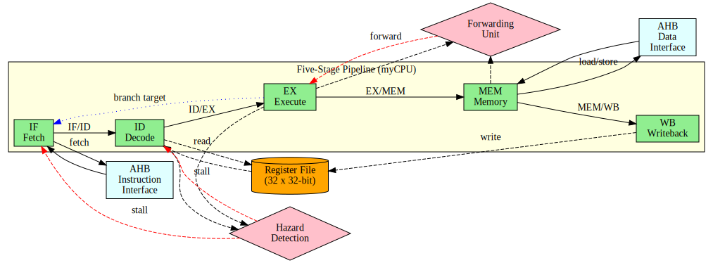

# Report 文件夹说明 / Report Folder Documentation

本文件夹包含项目报告相关的文档和资源。

## 📋 项目报告 / Project Report

**主要报告文件：** [`report.md`](report.md) - 基于RISC-V的五级流水线处理器及SoC系统设计报告

该报告包含：
- 完整的项目概述和设计目标
- 详细的系统架构设计（五级流水线、AHB总线、SoC架构）
- 关键模块的详细设计说明（含RTL图示）
- 功能验证和测试方法
- 创新点与项目价值分析
- 完整的源代码目录结构

## 文件列表 / File List

### 📄 报告文档 / Report Documents
- `report.md` - **项目报告正式版（Markdown格式）**
- `报告.docx` - 项目报告 Word 文档
- `报告模板.docx` - 报告模板 Word 文档
- `报告模板.md` - 报告模板 Markdown 格式

### 📊 RTL 设计图示 / RTL Design Diagrams
- `rtl_diagrams/` - RTL 设计图示目录
  - 包含使用 Yosys + GraphViz 生成的所有 RTL 设计图
  - 支持 SVG（矢量图）和 DOT（源文件）格式
  - 提供交互式 HTML 查看器

### 📝 使用说明 / Usage Guides
- `RTL图示使用说明.md` - RTL 图示集成指南
- `generate_rtl_diagrams.sh` - RTL 图示自动生成脚本

## RTL 图示快速访问 / Quick Access to RTL Diagrams

### 在线查看器 / Online Viewer
打开 `rtl_diagrams/index.html` 即可在浏览器中查看所有 RTL 图示。

### 可用的图示 / Available Diagrams

#### 高层架构 / High-Level Architecture
1. `pipeline_architecture.svg` - 五级流水线架构图
2. `soc_architecture.svg` - SoC 系统架构图

#### 流水线各阶段 / Pipeline Stages
1. `1_fetch.svg` - Fetch 阶段（取指）
2. `2_decode.svg` - Decode 阶段（译码）
3. `3_execute.svg` - Execute 阶段（执行）
4. `4_memory.svg` - Memory 阶段（访存）
5. `5_writeback.svg` - Writeback 阶段（写回）

#### 完整设计 / Complete Design
6. `6_myCPU.svg` - 完整的五级流水线处理器

#### AHB 总线子系统 / AHB Bus Subsystem
7. `7_ahb_interconnect.svg` - AHB 互连
8. `8_ahb_bram_controller.svg` - BRAM 控制器
9. `9_ahb_irom_controller.svg` - IROM 控制器

## 如何使用 RTL 图示 / How to Use RTL Diagrams

### 在报告中引用 / Reference in Reports

#### Markdown 格式
```markdown

```

#### Word/PowerPoint
1. 打开 `rtl_diagrams/` 目录
2. 选择对应的图示文件（建议使用 SVG 格式）
3. 插入 → 图片 → 从文件

#### LaTeX
```latex
\includegraphics[width=0.8\textwidth]{report/rtl_diagrams/pipeline_architecture.png}
```

### 导入到 Draw.io / Import to Draw.io

1. 访问 https://app.diagrams.net/
2. File → Import from → Device
3. 选择 SVG 或 DOT 文件
4. 编辑后可导出为其他格式

## 重新生成图示 / Regenerate Diagrams

如果修改了 RTL 代码，可以重新生成所有图示：

```bash
cd /path/to/LibreCore
bash report/generate_rtl_diagrams.sh
```

脚本将自动：
1. 使用 Yosys 综合各模块
2. 生成 DOT 格式图示
3. 转换为 SVG 格式
4. 保存到 `rtl_diagrams/` 目录

## 详细文档 / Detailed Documentation

更多详细信息请参考：
- `rtl_diagrams/README.md` - 完整的双语文档
- `rtl_diagrams/使用指南.md` - 中文详细使用指南
- `RTL图示使用说明.md` - 报告集成说明

## 技术支持 / Technical Support

如有问题，请参考：
1. RTL 图示文档：`rtl_diagrams/README.md`
2. Yosys 文档：http://www.clifford.at/yosys/documentation.html
3. GraphViz 文档：https://graphviz.org/documentation/

---

**Last Updated:** 2025-10-19  
**Version:** 1.0
