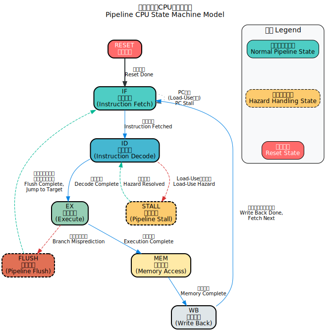
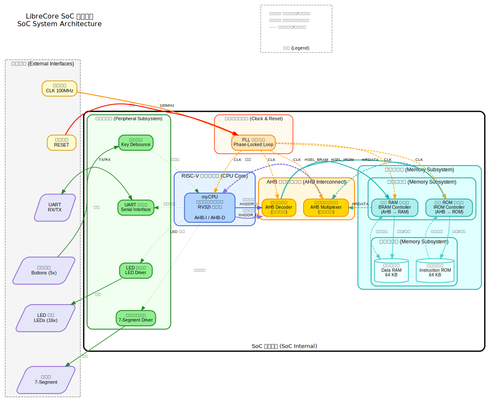
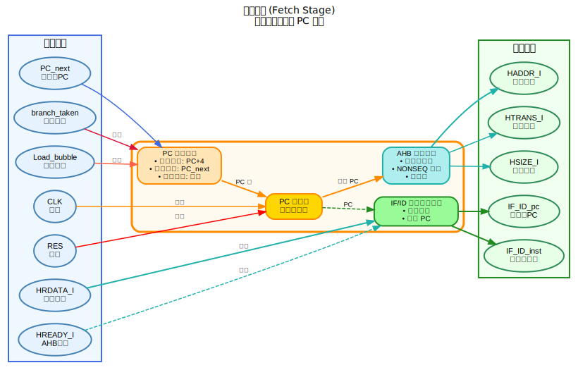
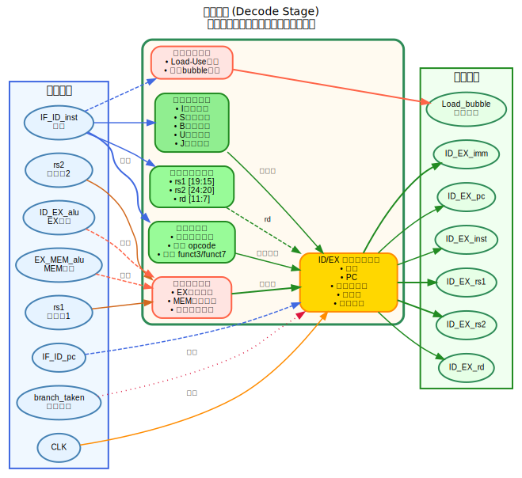
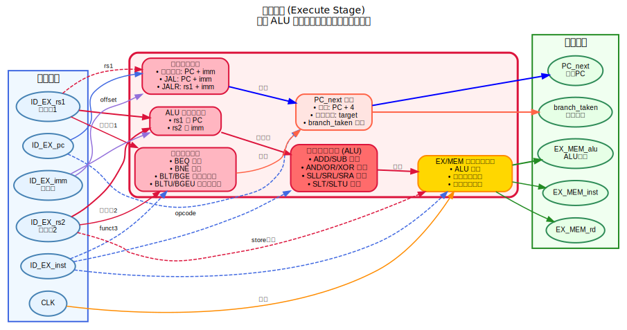
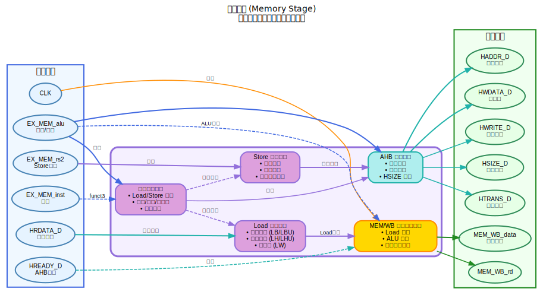
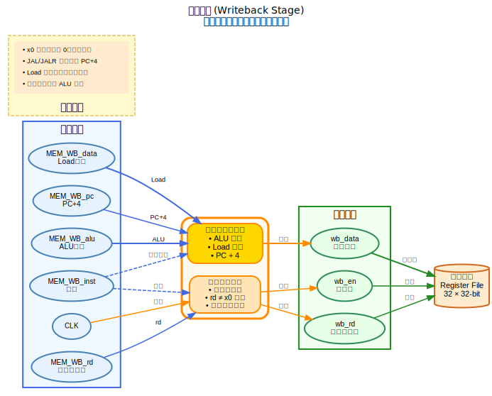
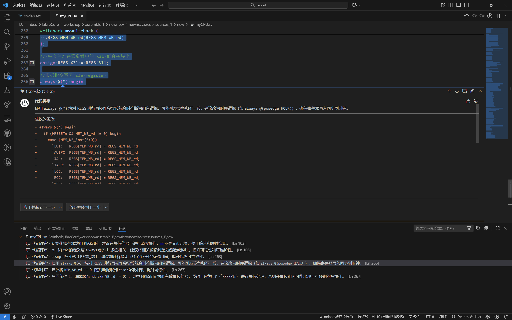

# FPGA创新设计大赛 AMD赛道 - 自主选题初级赛道设计报告

**竞赛名称：** 2025年全国大学生嵌入式芯片与系统设计竞赛——FPGA创新设计大赛 AMD赛道  
**赛道类型：** 自主选题 - 初级赛道  
**项目名称：** OpenRV - 基于RISC-V的五级流水线处理器及SoC系统  
**提交日期：** 2025-10-25

---

## 摘要

本项目实现了一个基于RISC-V RV32I指令集的五级流水线微型处理器及配套SoC系统。处理器采用经典的五级流水线架构（取指、译码、执行、访存、写回），完整支持RV32I基础整数指令集。系统采用AMBA AHB总线协议进行片上互连，实现了指令ROM控制器(IROM)和数据RAM控制器(BRAM)，支持字节、半字和字的访问操作。设计包含完整的数据前递机制和冒险检测逻辑，确保流水线的正确执行。项目使用Verilog硬件描述语言实现，在Xilinx FPGA平台上进行了验证。

**关键词：** RISC-V、五级流水线、AHB总线、SoC、FPGA

## 1. 项目概述

### 1.1 选题背景与意义

RISC-V作为一个开源的指令集架构，近年来在学术界和工业界得到了广泛关注。相比传统的商业指令集，RISC-V具有开放、简洁、可扩展等优点，非常适合作为处理器设计的学习平台。

本项目选择实现RISC-V RV32I处理器，具有以下意义：

1. **教育价值**：通过实现完整的五级流水线处理器，深入理解计算机组成原理中的流水线技术、数据冒险处理、控制冒险处理等核心概念。

2. **工程实践**：掌握大规模数字系统设计方法，包括模块化设计、接口设计、状态机设计等FPGA开发技能。

3. **总线协议应用**：通过实现AHB总线协议，学习工业标准的片上互连技术，为后续的SoC设计打下基础。

4. **开源贡献**：RISC-V的开放性使得本项目可以作为教学资源和开源贡献，供其他学习者参考。

### 1.2 项目目标

**功能目标：**

- 实现完整的RV32I基础整数指令集（包括算术、逻辑、分支、跳转、访存等指令）
- 采用五级流水线架构，提高指令执行效率
- 实现数据前递机制，减少流水线停顿
- 实现Load-Use冒险检测和处理
- 实现AHB总线接口，支持标准的片上互连
- 设计IROM和BRAM控制器，支持指令取指和数据访存
- 支持字节、半字、字的内存访问操作

**学习目标：**

- 掌握RISC-V指令集架构和处理器设计方法
- 掌握流水线处理器的设计技术，包括冒险检测和处理
- 掌握AHB总线协议的应用和实现
- 提升Verilog/SystemVerilog硬件描述语言编程能力
- 提升FPGA综合、仿真和调试能力
- 培养大规模数字系统的工程实践能力

### 1.3 技术规格


- **目标器件：** Xilinx FPGA (上板使用Artix-7芯片，FPGA型号NEXYS_A7)  
- **开发环境：** Vivado 2023.2
- **编程语言：** Verilog / SystemVerilog
- **验证平台：** Vivado仿真器，硬件验证平台
- **应用领域：** 嵌入式处理器、教学实验、SoC设计
- **总线协议：** AMBA AHB-Lite
- **指令集架构：** RISC-V RV32I

---

## 2. 需求分析与系统设计

### 2.1 功能需求分析

**核心功能模块：**

1. **五级流水线处理器核心：**
   - Fetch（取指）阶段：从指令存储器读取指令
   - Decode（译码）阶段：指令译码和寄存器读取
   - Execute（执行）阶段：ALU运算和分支判断
   - Memory（访存）阶段：数据存储器访问
   - Writeback（写回）阶段：结果写回寄存器

2. **AHB存储读写系统：**
    - 采用AMBA AHB协议实现片上存储系统，提升模块可复用性和扩展性
    - 集成BRAM控制器（支持字节、半字、字访问）和IROM控制器，均通过AHB接口与主机通信
    - 支持地址译码、数据路由、传输仲裁，能够无等待地实现连续读写
    - 采用状态机管理控制与数据阶段，处理写后读、读后写等紧邻流水事务，保证数据一致性和高效性

3. **基础外设：**
   - 锁相环模块
   - 按键以及按键消抖模块
   - LED
   - 七段数码管模块

**性能需求：**

- 工作频率：目标50-100 MHz（根据FPGA器件和综合结果）
- 流水线吞吐率：理想情况下每周期完成一条指令（CPI≈1）
- 访存延迟：单周期内存访问（BRAM延迟1周期）
- 支持指令集：RV32I基础整数指令集（不包括fence,ebreak,ecall以及CSR指令）

### 2.2 系统架构设计

#### 2.2.1 顶层架构

系统采用分层设计，主要包括处理器核心层和总线互连层。

```
┌──────────────────────────────────────────────────────────────────┐
│                        SoC Top Level                             │
│  ┌────────────────────────────────────────────────────────────┐  │
│  │                   myCPU (5 stages pipeline core)           │  │
│  │  ┌──────┐  ┌──────┐  ┌───────┐  ┌──────┐  ┌─────────┐      │  │
│  │  │Fetch │->│Decode│->│Execute│->│Memory│->│Writeback│      │  │
│  │  └──────┘  └──────┘  └───────┘  └──────┘  └─────────┘      │  │
│  │      │                               │                     │  │
│  │      │ AHB-I                         │ AHB-D               │  │
│  └──────┼───────────────────────────────┼─────────────────────┘  │
│         │                               │                        │
│         v                               v                        │
│         │                               │                        │
│   ┌─────v─────┐                   ┌────v──────┐                  │
│   │   IROM    │                   │   BRAM    │                  │
│   │Controller │                   │Controller │                  │
│   └───────────┘                   └───────────┘                  │
│         │                               │                        │
│   ┌─────v─────┐                   ┌────v──────┐                  │
│   │Instruction│                   │   Data    │                  │
│   │   ROM     │                   │    RAM    │                  │
│   └───────────┘                   └───────────┘                  │
└──────────────────────────────────────────────────────────────────┘
```
<!-- 外设部分要不要弄 -->

**系统架构说明：**

- **处理器核心（myCPU）**：采用哈佛架构，具有独立的指令接口（AHB-I）和数据接口（AHB-D）
- **AHB互连（AHB Interconnect）**：实现指令和数据总线的路由和仲裁
- **IROM控制器**：将AHB协议转换为Block ROM接口，用于指令存储
- **BRAM控制器**：将AHB协议转换为Block RAM接口，用于数据存储，支持读写操作


<!-- #### 2.2.2 状态机设计

[描述核心控制逻辑的状态机设计，这是初级赛道的重点考察内容]

这是模板部分我们现在这边是架构介绍更像2.2.1不是状态机 -->

#### 2.2.2 AHB状态机设计

在AHB_bram_controller模块使用状态机对当前周期跟前一周期主机发起的传输事务进行标记，反映当前控制模块数据传输状态，实现当AHB流水线传输当读请求紧随着写请求发起，BRAM不能及时处理数据，在不产生等待的情况下符合AHB协议正确读写数据。具体而言，代码显式展现的状态有IDLE，WRITE，READ跟FREE。而在实际的控制中基于前一时钟周期跟当前状态进行控制，实际上实现了IDLE，WRITE，READ，WRITE -> READ(BUSY)，READ -> WRITE(FREE)，NO TASK(FREE)六个状态。这么做的原因是标准的状态机需要在状态转换信号的下一个时钟周期进行状态转换，而这样不能满足当作为状态转换信号的控制信号到来就直接对其进行响应，进行对应控制的设计要求，因此采用这种设计逻辑。

**状态转换图：**


**状态说明：**

注：带有【等效态｜非真实状态】标注的条目为组合等效表达，用于说明行为关系，不对应寄存器化的实际状态值。

- IDLE：代表当前HRESETn为低，存储读写模块在被重置，没有在工作状态
- WRITE：代表当前主机发起一个写传输请求，在等效状态中用于判断下一步状态跳转
- READ：代表当前主机发起一个读传输请求，在等效状态中用于判断下一步状态跳转
- FREE：代表读写模块在工作状态，主机没有发起传输任务。代表存储读写模块在工作且主机没有发起读写传输请求，如果之前有由主机发起写传输请求之后连续发起读传输请求产生的未决事务写传输，此时能够在读传输的数据阶段进行写操作，完成之前的写传输，释放寄存器。
- 【等效态｜非真实状态】WRITE → READ（BUSY）：代表主机发起写传输请求之后连续发起读传输请求，由于BRAM读操作需要一个时钟周期而AHB接口协议读操作同样也是一个时钟周期，为了不拉低HREADYOUT产生等待减慢主机速度，这时候控制BRAM先进行读操作而将当前写操作存入寄存器进行缓冲，等BRAM空闲再发起当前写操作。而在等待BRAM有空闲能够进行之前的写操作的过程中，如果再次有读操作访问了之前写操作对应的地址会基于写操作的偏移跟写数据跟读出数据组合输出读数据实现前推避免读数据错误。
- 【等效态｜非真实状态】READ → WRITE（FREE）：代表主机发起读传输请求之后连续发起写传输请求，由于读传输请求在控制阶段已经被BRAM处理完在数据阶段输出数据，而写传输在控制阶段不需要对BRAM进行操作。因此如果之前有由主机发起写传输请求之后连续发起读传输请求产生的未决事务写传输，此时能够在读传输的数据阶段进行写操作，完成之前的写传输，释放寄存器。
- 【等效态｜非真实状态】NO TASK（FREE）：与实际状态 FREE 为同一状态

**展示外围模块AHB_bram_controller状态机设计而不是核心控制逻辑的原因：**
cpu部分采用5级流水线架构代码内部没有标准的状态机部分


#### 2.2.3 流水线架构设计

五级流水线设计采用经典的RISC流水线结构，各阶段功能如下：


**各阶段详细说明：**

1. **IF (Instruction Fetch) 取指阶段**
   - 根据PC值从指令存储器读取指令
   - 通过AHB指令接口发起读请求
   - 更新PC值（正常递增或分支跳转）
   - 将指令和PC传递到IF/ID流水线寄存器

2. **ID (Instruction Decode) 译码阶段**
   - 指令译码，识别指令类型和操作码
   - 从寄存器堆读取源操作数（rs1, rs2）
   - 生成立即数
   - 检测数据冒险，实施前递或插入气泡
   - 将译码结果传递到ID/EX流水线寄存器

3. **EX (Execute) 执行阶段**
   - ALU执行算术逻辑运算
   - 计算分支跳转目标地址
   - 进行分支条件判断
   - 生成PC_next和branch_taken信号
   - 将执行结果传递到EX/MEM流水线寄存器

4. **MEM (Memory) 访存阶段**
   - 对于Load/Store指令，通过AHB数据接口访问数据存储器
   - 处理字节、半字、字的读写操作
   - 处理内存对齐
   - 将结果传递到MEM/WB流水线寄存器

5. **WB (Write Back) 写回阶段**
   - 将ALU结果或内存读取数据写回目标寄存器
   - 更新寄存器堆

**流水线寄存器：**

- IF/ID：存储指令和PC
- ID/EX：存储译码结果、源操作数、立即数等
- EX/MEM：存储ALU结果、访存控制信号等
- MEM/WB：存储写回数据和目标寄存器地址

**冒险处理机制：**

1. **数据冒险（Data Hazard）**
   - 前递（Forwarding）：从EX/MEM和MEM/WB阶段前递数据到EX阶段
   - Load-Use冒险：检测并插入气泡（bubble）

2. **控制冒险（Control Hazard）**
   - 分支预测：采用静态预测（预测不跳转）
   - 分支错误时清空流水线（Flush）

**状态机等效模型：**

虽然五级流水线CPU没有显式的状态机实现，但我们可以从指令执行的角度将其等效为一个状态机。在这个模型中，每条指令在流水线中的执行过程可以看作是状态的转换过程。



**状态机模型说明：**

上图展示了五级流水线处理器的状态机等效模型。该模型将处理器的执行过程抽象为8个关键状态及其之间的转换关系。通过这种状态机视角，我们可以更清晰地理解流水线的工作机制、数据流动以及各种冒险情况的处理方式。

**状态定义：**

1. **RESET（复位状态）**：系统复位时的初始状态，初始化所有寄存器和控制信号。在此状态下，PC被置为初始地址（通常为0），所有流水线寄存器被清空，控制信号被复位。

2. **IF（取指状态）**：从指令存储器读取指令，PC指向当前指令地址。在这个状态下，处理器通过AHB指令总线向指令ROM发起读请求，同时准备PC的下一个值（通常为PC+4）。

3. **ID（译码状态）**：对指令进行译码，读取寄存器操作数，生成控制信号。译码器解析指令的各个字段（opcode、funct3、funct7等），确定指令类型，从寄存器堆读取源操作数（rs1、rs2），并生成立即数。同时，在这个阶段进行数据冒险检测。

4. **EX（执行状态）**：执行ALU运算或计算分支跳转地址。对于算术逻辑指令，ALU执行相应的运算；对于分支指令，计算分支目标地址并判断分支条件；对于跳转指令，计算跳转目标地址。此阶段还会处理数据前递。

5. **MEM（访存状态）**：对于Load/Store指令访问数据存储器，其他指令直接通过。Load指令通过AHB数据总线从数据RAM读取数据，Store指令将数据写入RAM。非访存指令在此阶段仅传递执行结果。

6. **WB（写回状态）**：将结果写回目标寄存器。根据指令类型，选择ALU结果、内存读取数据或PC+4作为写回数据，更新目标寄存器（rd）的值。

7. **STALL（暂停状态）**：发生Load-Use数据冒险时的流水线暂停状态。当检测到当前指令需要使用前一条Load指令的结果，但数据尚未就绪时，流水线进入此状态，暂停IF和ID阶段，直到数据可用。

8. **FLUSH（清空状态）**：分支预测错误时清空流水线并跳转到正确地址。当分支指令在EX阶段确定实际应该跳转，但之前已经错误地取了后续指令时，需要清空（作废）这些指令，将PC设置为正确的跳转目标地址。

**状态转换条件：**

- **正常流程**：RESET → IF → ID → EX → MEM → WB → IF（循环）
  - 这是理想情况下指令的执行路径。每个时钟周期，指令从一个状态前进到下一个状态，最终完成执行后回到IF状态取下一条指令。

- **Load-Use冒险处理**：ID → STALL（检测到冒险）→ ID（冒险解除后继续）
  - 当在ID阶段检测到当前指令依赖前一条Load指令的结果时，流水线进入STALL状态插入气泡（bubble），等待一个周期后继续译码。

- **分支预测错误处理**：EX → FLUSH（预测错误）→ IF（跳转到正确地址）
  - 当分支指令在EX阶段判断出预测错误时，流水线进入FLUSH状态，清空IF和ID阶段已取的指令，然后跳转到正确的目标地址重新取指。

- **流水线暂停**：IF → IF（在Load-Use冒险期间，PC保持不变）
  - 在发生Load-Use冒险时，IF阶段的PC保持不变，不取新指令，配合STALL状态共同实现流水线暂停。

**核心流程说明：**

在理想情况下，流水线中的每条指令每个时钟周期前进一个阶段（状态），多条指令在不同阶段并行执行，实现指令级并行（ILP）。但在以下情况下会发生状态转换的特殊处理：

1. **数据冒险处理**：当检测到Load-Use冒险时，流水线进入STALL状态，暂停IF和ID阶段，等待数据就绪后继续执行。这种暂停是必要的，因为数据前递机制无法解决Load指令紧接着使用其结果的情况（Load指令的数据在MEM阶段才可用，但后续指令在EX阶段就需要使用）。

2. **控制冒险处理**：当分支指令在EX阶段判断出预测错误时，流水线进入FLUSH状态，清空IF和ID阶段的指令（将其转换为NOP），并跳转到正确的目标地址。这个机制保证了程序的正确执行，但会带来2个周期的性能损失（分支惩罚）。

3. **连续执行**：在没有冒险的情况下，指令流顺序通过五个状态，实现高效的流水线执行。理想情况下，CPI（Cycles Per Instruction）接近1，即每个时钟周期完成一条指令。

4. **并行执行**：从宏观角度看，在稳定运行时，流水线的五个阶段同时处理五条不同的指令，这就是流水线提高处理器性能的核心机制。

这种状态机模型清晰地展示了流水线CPU的执行流程和冒险处理机制，有助于理解流水线的工作原理。通过将流水线处理器等效为状态机，我们可以更好地分析其行为、优化其性能，并为后续的设计改进（如添加分支预测器、优化前递路径等）提供理论基础。

<!-- 这里跟模板#### 2.2.3 时序设计

[描述关键路径的时序设计，体现时序分析能力] 不匹配 

#### 2.2.3 时序设计

对于cpu跟外设BRAM的数据读写时序，参照AMBA AHB协议进行实现，将数据传输分成控制阶段跟数据阶段，实现在控制阶段下一个时钟周期进行数据传输，每个传输需要2个时钟周期，但能够通过流水线形式运行这样每个周期都有控制信号跟数据传输。

-->
#### 2.2.4 AHB总线设计

系统采用AMBA AHB-Lite协议实现片上互连。

**AHB信号定义：**

- **地址和控制信号**：
  - HADDR[31:0]：32位地址总线
  - HTRANS[1:0]：传输类型（IDLE, BUSY, NONSEQ, SEQ）
  - HWRITE：读写控制（0=读，1=写）
  - HSIZE[2:0]：传输大小（字节、半字、字）
  - HBURST[2:0]：突发类型
  - HPROT[3:0]：保护控制

- **数据信号**：
  - HWDATA[31:0]：写数据
  - HRDATA[31:0]：读数据

- **响应信号**：
  - HREADY：传输完成
  - HRESP：传输响应（OKAY, ERROR）

**地址映射：**

- 指令ROM：0x0000_0000 - 0x0000_FFFF（64KB）
- 数据RAM：0x0001_0000 - 0x0001_FFFF（64KB）



### 2.3 接口设计

**处理器核心接口：**

**输入接口：**
- HCLK：系统时钟
- HRESETn：复位信号（低有效）
- HRDATA_I[31:0]：指令读数据
- HREADY_I：指令传输完成
- HRESP_I：指令传输响应
- HRDATA_D[31:0]：数据读数据
- HREADY_D：数据传输完成
- HRESP_D：数据传输响应

**输出接口：**
- HADDR_I[31:0]：指令地址
- HTRANS_I[1:0]：指令传输类型
- HSIZE_I[2:0]：指令传输大小
- HADDR_D[31:0]：数据地址
- HWDATA_D[31:0]：数据写数据
- HWRITE_D：数据读写控制
- HTRANS_D[1:0]：数据传输类型
- HSIZE_D[2:0]：数据传输大小

---

## 3. 详细设计与实现

<!-- ### 3.1 核心算法设计

[描述项目中用到的核心算法]

**算法原理：**
[用数学公式或伪代码描述算法]

**硬件实现策略：**
[描述如何将算法映射到硬件]
 -->
### 3.1 核心算法设计
<!-- 这边有点偏离cpu算法 -->
**ALU算法设计：**

ALU支持以下运算类型：
- 算术运算：ADD, SUB
- 逻辑运算：AND, OR, XOR
- 移位运算：SLL, SRL, SRA
- 比较运算：SLT, SLTU

**分支判断算法：**

根据funct3字段判断分支条件：
- BEQ：rs1 == rs2
- BNE：rs1 != rs2
- BLT：rs1 < rs2（有符号）
- BGE：rs1 >= rs2（有符号）
- BLTU：rs1 < rs2（无符号）
- BGEU：rs1 >= rs2（无符号）

**Load-Use冒险检测算法：**

```
if (ID_EX_is_load && 
    ((ID_EX_rd == IF_ID_inst[19:15]) || 
     (ID_EX_rd == IF_ID_inst[24:20]))) {
    插入气泡
    PC保持不变
}
```

### 3.2 关键模块设计

#### 3.2.1 Fetch模块



**功能描述：**
Fetch模块负责从指令存储器取指，管理PC值的更新。支持正常PC递增、分支跳转和Load-Use冒险时的PC保持。

**端口定义：**

```verilog
module fetch (
    input         CLK,
    input         RES,
    input  [31:0] HRDATA_I,        // AHB读数据（指令）
    input         HREADY_I,        // AHB传输完成
    input         HRESP_I,         // AHB响应
    input  [31:0] PC_next,         // 下一个PC值
    input         branch_taken,    // 分支跳转标志
    input         Load_bubble,     // Load-Use冒险标志
    
    output [31:0] PC,              // 当前PC
    output [31:0] HADDR_I,         // 指令地址
    output        HWRITE_I,        // 写使能（固定为0）
    output [2:0]  HSIZE_I,         // 传输大小（固定为WORD）
    output [2:0]  HBURST_I,        // 突发类型
    output [1:0]  HTRANS_I,        // 传输类型
    output        HMASTLOCK_I,     // 主设备锁定
    output [31:0] HWDATA_I,        // 写数据（未使用）
    output [3:0]  HPROT_I,         // 保护控制
    output [31:0] IF_ID_pc,        // IF/ID流水线寄存器PC
    output [31:0] IF_ID_inst       // IF/ID流水线寄存器指令
);
```

**逻辑设计：**
- PC更新逻辑：根据branch_taken和Load_bubble信号选择PC_next或PC+4
- AHB接口控制：发起NONSEQ传输，固定为字读取
- 流水线寄存器：在时钟上升沿锁存指令和PC

#### 3.2.2 Decode模块



**功能描述：**
Decode模块负责指令译码、寄存器读取、立即数生成以及数据冒险检测。

**端口定义：**

```verilog
module decode (
    input         CLK,
    input  [31:0] IF_ID_pc,
    input  [31:0] IF_ID_inst,
    input  [31:0] rs1,             // 寄存器堆读数据
    input  [31:0] rs2,
    input  [31:0] ID_EX_alu,       // 前递数据
    input  [4:0]  EX_MEM_rd,
    input  [31:0] EX_MEM_alu,
    input  [31:0] EX_MEM_inst,
    input  [4:0]  MEM_WB_rd,
    input         branch_taken,
    input  [31:0] load_data,
    
    output [31:0] ID_EX_pc,
    output [31:0] ID_EX_inst,
    output [31:0] ID_EX_rs1,
    output [31:0] ID_EX_rs2,
    output [4:0]  ID_EX_rd,
    output [31:0] ID_EX_imm,
    output        ID_EX_is_jalr,
    output        ID_EX_is_jal,
    output        ID_EX_is_sys,
    output        ID_EX_is_branch,
    output        Load_bubble
);
```

**逻辑设计：**
- 指令译码：根据opcode识别指令类型
- 立即数生成：根据指令格式（I/S/B/U/J型）生成立即数
- Load-Use检测：检测当前指令是否依赖前一条Load指令的结果
- 数据前递：从后续流水线阶段前递数据

#### 3.2.3 Execute模块



**功能描述：**
Execute模块负责ALU运算、分支判断和跳转地址计算。

**主要功能：**
- ALU运算：支持加减、逻辑、移位、比较等操作
- 分支判断：计算分支条件，生成branch_taken信号
- 地址计算：计算分支、跳转目标地址
- PC_next生成：确定下一个PC值

#### 3.2.4 Memory模块



**功能描述：**
Memory模块负责数据存储器访问，通过AHB接口进行Load/Store操作。

**主要功能：**
- Load操作：从数据存储器读取数据，支持字节、半字、字
- Store操作：向数据存储器写入数据，支持字节、半字、字
- 数据对齐和扩展：处理非对齐访问和符号/零扩展
- AHB接口控制：生成AHB传输控制信号

#### 3.2.5 Writeback模块



**功能描述：**
Writeback模块负责将执行结果写回寄存器堆。

**主要功能：**
- 选择写回数据源：ALU结果、内存读数据或PC+4
- 生成寄存器写使能信号
- 处理CSR指令的写回

#### 3.2.1 AHB_bram_controller
(AHB_irom_controller与之类似只是删去部分代码节省资源)


**功能描述：**
实现对vivado block memory IP进行控制，能够作为AHB从机被主机进行读写，作为bridge将BRAM Native接口转换成AHB接口。并且能够正确处理主机时序跟BRAM时序，当BRAM不能及时处理读写传输能够对未决事务进行暂存跟后续执行，对数据进行前推，实现不暂停条件下连续读写。

**端口定义：**

```verilog
module AHB_bram_controller #(
    parameter integer DATA_WIDTH = 32,
    parameter integer ADDR_WIDTH = 32
    )(

    //=====AHB-Lite slave interface=========================================================================
    //global signals
    // Clock and reset signals
    input  wire HCLK,        // AHB system clock input
    input  wire HRESETn,     // AHB system reset input, active low

    // Slave select signal
    input  wire HSELx,       // Slave select signal, asserted when this slave is selected

    // Address and control signals
    input wire     [ADDR_WIDTH-1:0] HADDR,      // Address bus, specifies the address for the current transfer
    input wire                      HWRITE,     // Transfer direction; 1 = write, 0 = read
    input wire     [2:0]            HSIZE,      //simplified here// Transfer size; indicates the size of the transfer (byte0, halfword1, word2 etc.)
    input wire     [2:0]            HBURST,     //not use now// Burst type; indicates if the transfer is single, incrementing, or wrapping burst
    input wire     [3:0]            HPROT,      //not use now// Protection control signals; provides information about the bus access type
    input wire     [1:0]            HTRANS,     // Transfer type; indicates the type of the current transfer (IDLE0, BUSY1, NONSEQ2, SEQ3)
    input wire                      HMASTLOCK,  //not use now// Locked transfer signal; indicates if the current transfer is part of a locked sequence
    input wire                      HREADY,     // Transfer ready input; indicates if the previous transfer has finished 1

    // Write data bus
    input wire     [DATA_WIDTH-1:0] HWDATA,     // Write data bus; carries data from master to slave during write operations

    // Transfer response signals
    output wire    HREADYOUT,                   // Transfer ready output; indicates if the slave is ready to complete the transfer
    output wire    HRESP,                       // Transfer response; indicates the status of the transfer (OKAY0, ERROR1)

    // Read data bus
    output reg     [DATA_WIDTH-1:0] HRDATA,     // Read data bus; carries data from slave to master during read operations
    //=====AHB-Lite slave interface=========================================================================

    //=====single port ram BRAM interface=========================================================================
    output reg  [ADDR_WIDTH-1:0]       bram_addra,   // BRAM address port (write/read address)
    output reg  [DATA_WIDTH-1:0]       bram_dina,    // BRAM data input port (write data)
    input  wire [DATA_WIDTH-1:0]       bram_douta,   // BRAM data output port (read data)
    output reg                         bram_ena,     // BRAM enable signal
    output reg  [(DATA_WIDTH/8)-1 : 0]  bram_wea     // BRAM write enable (byte-wise)
    //=====single port ram BRAM interface=========================================================================
);
```

**逻辑设计：**
AHB_bram_controller 面向 AHB-Lite 与单端口 BRAM 的桥接，遵循 AHB“控制阶段+数据阶段”的两拍传输模型，并在不拉低 HREADYOUT 的前提下处理读后写/写后读的紧邻流水事务。

- 传输阶段与对齐
    - 控制阶段采样 `HSELx/HTRANS/HWRITE/HSIZE/HADDR`，数据阶段完成 `HRDATA/写入 BRAM`。
    - 仅支持单拍（`HBURST=Single`）且不支持 `HLOCK`；`HSIZE` 支持字节/半字/字（≤word）。
    - 对齐检查：半字需 `HADDR[0]=0`，字需 `HADDR[1:0]=0`，违规置 `HRESP=1`（ERROR）。

- 写路径（字节使能与延迟对齐）
    - 控制阶段锁存 `HADDR->addr_r`、`HSIZE->hsize_r`，解码字节写使能 `bram_wea_decode`（按 `HSIZE` 与地址低位选择字节使能信号）。
    - 数据阶段驱动 `bram_addra/ena/wea/dina`，确保与 `HWDATA` 对齐写入。

- 读路径与前推（forwarding）
    - 读控制到达即拉高 `bram_ena` 并给出 `bram_addra`，下拍从 `bram_douta` 取数。
    - 若出现“写→读”紧邻（RAW hazard），写操作暂存到寄存器（`addr_reg/data_reg/bram_wea_reg`），读返回阶段按 `HSIZE/offset` 将 `data_reg` 与 `bram_douta` 按字节粒度合成，保证读到最新值。

- 无等待策略与轻量状态
    - `HREADYOUT` 恒为 1，实现总线无等待；用组合态 `bus_state`（FREE/WRITE/READ）+ 上拍 `bus_state_d1` 描述序列关系。
    - 发生“写→读”时置 `register_active=1`，等到“FREE 或 读→写”窗口将暂存写一次性回放至 BRAM，清空寄存器。
    - 以 `bram_2BUSY` 监控未决回放是否溢出；若超过可承载阈值（变为 `2'b10`），置 `HRESP=1` 报错。

- 协议与限制
    - `HRESP=1` 条件：不支持的 `HSIZE`、非 SINGLE 的 `HBURST`、未决事务溢出、地址未对齐。
    - 设计假设：单端口 BRAM、32-bit 数据宽、1 拍读延迟；参数化 `ADDR_WIDTH/DATA_WIDTH` 与 `ADDR_LSB` 适配不同位宽。
    - 未实现：突发传输、锁定传输、保护位/缓存一致性等高级特性。

#### 3.2.2 AHB_interconnect


**功能描述：**
AHB_interconnect 为 AHB-Lite 提供轻量级两从机互连，集成地址译码与返回路径多路复用。将主机侧地址 `HADDR` 译码为从机片选 `HSEL[1:0]`，并依据片选从对应从机回传 `HRDATA/HRESP/HREADY` 至主机侧。模块本身不引入等待，握手与延迟完全由被选从机决定；聚焦在“片选+响应返回”。

**端口定义：**

```verilog
module AHB_interconnect #(
        parameter ADDR_WIDTH = 32,
        parameter DATA_WIDTH = 32
)(
        input  wire HCLK,
        input  wire HRESETn,
        input  wire [ADDR_WIDTH -1:0] HADDR,
        input  wire [DATA_WIDTH-1:0] HRDATA0,
        input  wire HRESP0,
        input  wire HREADYOUT0,
        input  wire [DATA_WIDTH-1:0] HRDATA1,
        input  wire HRESP1,
        input  wire HREADYOUT1,

        output wire [DATA_WIDTH-1:0] HRDATA,
        output wire HRESP,
        output wire [1:0] HSEL,
        output wire HREADY
);
```

**逻辑设计：**
AHB_interconnect 由两部分组成：

- 地址译码器（AHB_decoder）
    - 输入：`HADDR`、`HRESETn`；输出：`HSEL[1:0]`（one-hot 片选）。
    - 地址映射策略在译码器内部定义，可通过高位地址划分存储器与外设窗口。

- 响应多路复用器（AHB_multiplexor）
    - 根据 `HSEL` 选择对应从机返回路径，将 `HRDATAx/HRESPx/HREADYOUTx` 直通到主机侧输出 `HRDATA/HRESP/HREADY`。
    - 命名说明：本模块输出端口为 `HREADY`（等价主机侧 HREADY），其值来自被选从机的 `HREADYOUTx`，不额外插入等待。

特性与限制：

- 支持参数化 `ADDR_WIDTH/DATA_WIDTH`；当前实现为两从机，易扩展至 N 从机（扩大 `HSEL` 位宽与多路复用输入）。
- 不负责写数据/控制信号的路由与仲裁，写通路由顶层直接依 `HSEL` 连接到各从机；无多主机支持。
- 不改变 AHB-Lite 的握手与时序，系统整体等待与错误由被选从机的 `HREADYOUT/HRESP` 决定。
- 未实现突发/锁定等高级特性，本模块对这些特性透明；


### 3.3 资源使用设计

存储读写部分遵照AHB协议但未完全实现所有功能，只实现了满足当前处理器数据吞吐的功能，节省FPGA资源，缩短项目开发时间。

<!-- 这部分需要进一步review -->
**逻辑资源规划：**

- **LUT（查找表）使用策略：**
  - **处理器核心逻辑**：
    - ALU运算单元：实现32位加减法、逻辑运算（AND/OR/XOR）、移位运算（SLL/SRL/SRA）和比较运算（SLT/SLTU）
    - 指令译码器：根据opcode、funct3、funct7字段识别指令类型，生成控制信号
    - 立即数生成器：支持I/S/B/U/J五种指令格式的立即数提取和符号扩展
    - 分支判断逻辑：实现BEQ/BNE/BLT/BGE/BLTU/BGEU六种分支条件判断
  - **数据冒险检测与前递**：
    - 前递条件检测：比较流水线各阶段的寄存器地址，生成前递控制信号
    - Load-Use冒险检测：识别Load指令后紧跟使用其结果的指令
    - 前递数据选择器：多路复用器选择寄存器堆、EX阶段或MEM阶段的数据
  - **AHB控制器逻辑**：
        - BRAM/IROM 控制器：字节使能生成、地址对齐检测、读写状态管理
        - AHB 状态控制：通过写读状态寄存器处理“写后读”等紧邻流水事务
        - 数据前推逻辑：处理写后读冒险的字节粒度数据合成
        - 备用的 AHB_interconnect/decoder/multiplexor 当前未在顶层使用，编译时可选择剪裁以减少资源
  - **优化策略**：
    - 采用组合逻辑表达式而非标准状态机，减少状态寄存器和转换逻辑
    - 精简冗余的控制路径，删除不必要的中间寄存器
    - 优化关键路径的组合逻辑深度，满足50-100MHz工作频率要求

- **寄存器（FF）使用：**
  - **流水线寄存器**（约200-300个32位寄存器）：
    - IF/ID寄存器：指令（32位）、PC（32位）
    - ID/EX寄存器：指令（32位）、PC（32位）、源操作数rs1/rs2（各32位）、立即数（32位）、控制信号（约10位）
    - EX/MEM寄存器：指令（32位）、PC（32位）、ALU结果（32位）、rs2数据（32位）、控制信号（约10位）
    - MEM/WB寄存器：指令（32位）、写回数据（32位）、目标寄存器地址（5位）、控制信号（约5位）
  - **程序计数器PC**（32位寄存器）：维护当前指令地址，支持正常递增和分支跳转
  - **通用寄存器堆**（32个32位寄存器）：x0-x31寄存器，其中x0硬连线为0
  - **AHB控制寄存器**：
    - 地址和控制信号缓存：addr_r、hsize_r、write_pending、read_pending
    - 未决事务缓冲：addr_reg、data_reg、bram_wea_reg（用于写后读冒险处理）
    - 状态标志：register_active、bus_state_d1、bram_addra_d1
    - 分支历史缓冲：branch_taken_buffer、branch_taken_buffer2（防止分支重复执行）
  - **优化措施**：
    - 删除冗余的多级缓冲寄存器（如原register_active_d1），改用组合逻辑判断
    - 合并功能相近的状态标志，减少寄存器数量
    - 使用使能信号控制寄存器更新，降低动态功耗

- **时钟资源：**
  - **单时钟域设计**：所有模块使用统一的HCLK时钟，简化时序约束和跨时钟域处理
  - **全局时钟网络**：利用FPGA的专用全局时钟布线资源，保证时钟偏斜最小化
  - **同步复位**：HRESETn采用同步复位方式（在时钟上升沿采样），提高时序可靠性
  - **时钟约束**：
    - 目标工作频率：50-100 MHz
    - 建立时间裕量：≥1ns
    - 保持时间裕量：≥0.5ns
  - **无时钟门控**：当前设计不使用时钟门控技术，优先保证设计简洁性和可靠性

**存储资源规划：**

- **BRAM（Block RAM）使用：**
  - **指令ROM（IROM）**：
    - 使用Xilinx Block Memory Generator IP核
    - 配置为单端口ROM模式，只读访问
    - 容量：64KB（16384 x 32-bit = 16K words）
        - 资源占用：Block RAM resource(s) (36K BRAMs): 1
    - 读延迟：1个时钟周期
    - 地址映射：暂未进行地址映射由cpu通过特定端口直接访问
    - 初始化：通过.coe文件加载程序二进制代码
  - **数据RAM（BRAM）**：
    - 使用Xilinx Block Memory Generator IP核
    - 配置为单端口RAM模式，支持读写访问
    - 容量：64KB（16384 x 32-bit = 16K words）
        - 资源占用：Block RAM resource(s) (36K BRAMs): 1
    - 读延迟：1个时钟周期
    - 写模式：支持字节粒度写使能（4-bit byte enable）
    - 地址映射：暂未进行地址映射由cpu通过特定端口直接访问
    - 应用：存储程序数据段、堆栈、全局变量等
  - **BRAM利用率**：
    - Artix-7 (xc7a100t)共有135个36Kb BRAM块
    - 本设计使用2个BRAM块，利用率约1.5%
    - 预留充足资源用于后续扩展（如增加Cache、外设缓冲等）

- **分布式RAM使用：**
  - **通用寄存器堆**（Register File）：
    - 32个32位寄存器（x0-x31），共1024位存储
        - 实现方式：使用寄存器阵列（Flip-Flop）
    - 原因：
      - 支持2读1写端口，需要多端口访问
      - 寄存器实现延迟为0，分布式RAM有1周期读延迟
      - 寄存器数量相对较少，不会过度消耗FF资源
    - 资源占用：32个32位寄存器 = 1024个FF
    - 特殊处理：x0寄存器硬连线为0，写操作被忽略
  - **AHB临时缓冲**：
    - addr_reg、data_reg等小容量缓冲使用寄存器实现
    - 避免分布式RAM的额外读延迟，保证AHB无等待传输

**资源优化总结：**

1. **轻量级设计**：通过精简AHB功能（仅实现单次传输，不支持burst）和优化控制逻辑，显著降低LUT和FF使用量
2. **BRAM高效利用**：采用单端口BRAM配置，节省资源；通过控制器的巧妙设计（写后读前推机制）弥补单端口限制
3. **可扩展性预留**：当前资源利用率较低，为后续添加Cache、TLB、浮点单元、外设控制器等功能预留了充足空间
4. **时序优化**：单时钟域设计和合理的流水线划分保证了50-100MHz的工作频率，满足教学和基础应用需求

---


## 4. LLM 辅助优化记录

### 4.1 设计阶段LLM辅助

#### 4.1.1 架构设计咨询

**优化目标：** 确定五级流水线处理器的最佳系统架构

**用户输入：**

```
我正在设计一个基于RISC-V RV32I的五级流水线处理器，需要实现完整的指令执行流水线。
目标器件是Xilinx Artix-7 FPGA（NEXYS_A7），主要性能要求是支持完整的RV32I指令集，
并实现数据冒险处理机制。请帮我分析最适合的系统架构设计方案，并给出模块划分建议。

具体需求：
1. 实现经典五级流水线（IF-ID-EX-MEM-WB）
2. 支持数据前递（Data Forwarding）机制
3. 处理Load-Use数据冒险
4. 采用AHB总线协议进行片上互连
5. 支持分支跳转指令的正确执行

请提供架构建议和关键设计要点。
```

**LLM回答：**

```
针对RISC-V五级流水线处理器的设计，我建议采用以下架构：

1. **模块化五级流水线设计**：
   - Fetch模块：负责指令取指和PC管理
   - Decode模块：负责指令译码、寄存器读取和冒险检测
   - Execute模块：负责ALU运算和分支判断
   - Memory模块：负责数据存储器访问
   - Writeback模块：负责寄存器写回

2. **流水线寄存器设计**：
   - IF/ID寄存器：传递指令和PC
   - ID/EX寄存器：传递译码结果、源操作数、控制信号
   - EX/MEM寄存器：传递ALU结果、访存控制信号
   - MEM/WB寄存器：传递写回数据和目标寄存器

3. **数据冒险处理机制**：
   - 实现数据前递单元，从EX/MEM和MEM/WB阶段前递数据到EX阶段
   - 在Decode阶段检测Load-Use冒险，必要时插入气泡（bubble）
   - 前递优先级：MEM阶段数据优先于EX阶段数据

4. **控制冒险处理**：
   - 在Execute阶段进行分支判断
   - 分支预测错误时清空（flush）流水线
   - 使用branch_taken信号控制PC更新

5. **总线接口设计**：
   - 采用哈佛架构，分离指令总线和数据总线
   - 使用AHB-Lite协议实现标准化接口
   - 支持字节、半字、字的访问操作
```

**采用建议：**

基于LLM的建议，项目采用了以下架构方案：

1. **模块化设计**：严格按照五个流水线阶段划分模块，每个模块职责清晰
2. **流水线寄存器**：在每个模块边界添加流水线寄存器，保证时序正确
3. **数据前递机制**：在Decode模块中实现前递逻辑，优先使用MEM阶段数据
4. **Load-Use冒险检测**：在Decode阶段实现冒险检测逻辑
5. **哈佛架构**：采用独立的指令接口和数据接口，提高访存效率

#### 4.1.2 流水线冒险检测逻辑设计

**优化目标：** 设计完善的数据冒险检测和前递机制

**用户输入：**

```
在五级流水线CPU中，我需要设计数据前递（Data Forwarding）机制来处理数据冒险。
当前的前递逻辑会检测EX阶段和MEM阶段是否有写回到当前指令需要读取的寄存器。

当前设计的前递逻辑如下：
- 检测ID/EX阶段的目标寄存器是否与当前指令的源寄存器匹配
- 检测EX/MEM阶段的目标寄存器是否与当前指令的源寄存器匹配

但我担心前递的优先级问题。如果同时满足EX阶段前递和MEM阶段前递的条件，
应该优先选择哪个？请帮我分析并给出建议。
```

**LLM回答：**

```
在数据前递机制中，优先级选择非常重要。正确的前递优先级应该是：

**MEM阶段数据应该优先于EX阶段数据**

原因如下：
1. MEM阶段的数据更"新"，是时间上更接近当前需要的值
2. 考虑以下场景：
   ```
   add x1, x2, x3  # EX阶段，计算结果在EX/MEM寄存器
   add x1, x4, x5  # MEM阶段，计算结果在MEM/WB寄存器
   add x6, x1, x7  # ID阶段，需要使用x1
   ```
   在这种情况下，第三条指令应该使用MEM阶段的x1值（来自第二条指令），
   而不是EX阶段的x1值（来自第一条指令）

建议的实现方式：
```verilog
always @(*) begin
    if (forward_rs1_MEM)        id_ex_rs1_1 = EX_MEM_alu;  // 优先MEM阶段
    else if (forward_rs1_EX)    id_ex_rs1_1 = ID_EX_alu;   // 其次EX阶段
    else                        id_ex_rs1_1 = rs1;         // 最后寄存器堆
end
```
```

**优化实施：**

根据LLM的建议，调整了前递优先级：

**优化前代码：**
```verilog
always @(*) begin
    if       (forward_rs1_EX)     id_ex_rs1_1 = ID_EX_alu;
    else if  (forward_rs1_MEM)    id_ex_rs1_1 = EX_MEM_alu;
    else                          id_ex_rs1_1 = rs1;       

    if        (forward_rs2_EX)  id_ex_rs2_1 = ID_EX_alu;
    else if   (forward_rs2_MEM) id_ex_rs2_1 = EX_MEM_alu;
    else                        id_ex_rs2_1 = rs2;       
end
```

**优化后代码：**
```verilog
always @(*) begin
    if            (forward_rs1_MEM)    id_ex_rs1_1 = EX_MEM_alu;  // 优先MEM
    else if       (forward_rs1_EX)     id_ex_rs1_1 = ID_EX_alu;   // 其次EX
    else                               id_ex_rs1_1 = rs1;       

    if             (forward_rs2_MEM) id_ex_rs2_1 = EX_MEM_alu;    // 优先MEM
    else if        (forward_rs2_EX)  id_ex_rs2_1 = ID_EX_alu;     // 其次EX
    else                             id_ex_rs2_1 = rs2;       
end
```

这个优化确保了在多个流水线阶段都有相同寄存器写回时，使用最新的数据值，避免了数据冒险导致的错误结果。

#### 4.1.3 状态机设计优化

**优化目标：** 优化控制逻辑设计


**用户输入：**

```
查看整个代码提出你觉得能够节省资源简化的地方
(LLM读取了整个文件)

```

**LLM回答：**
(展示部分进行了代码修改的回答)
```
下面给出对当前 AHB_bram_controller_simple.v 代码的全面精简与资源优化建议（功能不变前提下），分层说明：状态/控制、写路径、读路径与数据旁路、时序/复位、可综合性、参数化与可移植性、潜在隐患与可测性补强。可按需挑选实施。

1. 状态与控制逻辑精简
bus_state / bram_state / bram_2BUSY 三套状态过重

现在：bus_state 只是区分本拍是否是写/读/空闲；bram_state 又对前后拍组合做状态判定；bram_2BUSY 再次扩展 busy 层数并用于 HRESP。
可选优化：
方案A：删除 bram_state 和 bram_2BUSY，直接用 write_pending 和 read_pending（当前拍+上一拍）推导“冲突/忙”条件。例如：
busy_condition = write_pending & read_request_next 或 write_request与读请求交叠。
方案B：保留一个 2bit 状态（例如 IDLE / WRITE / READ / TRANSITION），用上拍的写请求和本拍读请求判断是否需要产生 HRESP。
好处：减少组合比较 + 减少两个寄存器 + 去掉多余 MUX。
......
(省略部分)
......
12. 实施优先级建议
按“收益/改动风险”排序：

修正不规范时序敏感列表（or HRESETn → or negedge HRESETn）。
加入地址对齐检测，避免非法访问。
合并 register_active* / bram_2BUSY 逻辑。
HRDATA 旁路统一字节合成，删除重复 case。
去除无必要清零输出，减少翻转。
参数化 offset 计算，准备可扩展性。
引入断言（仿真专用）验证 corner case。
如果你希望，我可以下一步直接帮你：

A) 先做“低风险修正包”（复位/对齐/HRESP简化）
B) 再做“结构重构包”（统一旁路/删除多余状态）
告诉我你想执行哪一步或希望我直接提交第一阶段修改。需要的话我可以按阶段打补丁。

要不要继续我来动手？
```

**代码改进：**

```verilog

always @(*) begin
    if(bus_state_d1 == bus_WRITE && bus_state == bus_READ) begin
        bram_state = bram_BUSY;
    end else if((bus_state == bus_FREE) ||(bus_state_d1 == bus_READ && bus_state == bus_WRITE)) begin
        bram_state = bram_FREE;
    end else if((bus_state_d1 == bus_READ && bus_state == bus_READ) || (bus_state_d1 == bus_WRITE && bus_state == bus_WRITE) 
              ||(bus_state_d1 == bus_FREE && bus_state == bus_WRITE) || (bus_state_d1 == bus_FREE && bus_state == bus_READ)) begin
        bram_state = bram_WORK;
    end else begin
        bram_state = bram_IDLE;
    end
end

always @(*) begin
    if (!HRESETn) begin
        register_active = 1'b0;
    end else if (bram_state == bram_BUSY) begin
        register_active = 1'b1;
    end else if (bram_state == bram_FREE) begin
        register_active = 1'b0;
    end else begin
        register_active = register_active;
    end
    
end


[原始代码]
(将原来bram_state状态表示改成组合表示更直接反映控制逻辑)

always @(posedge HCLK or negedge HRESETn) begin
    if (!HRESETn) begin
        register_active <= 1'b0;
    end else if (bus_state_d1 == bus_WRITE && bus_state == bus_READ) begin
        register_active <= 1'b1;
    end else if (((bus_state == bus_FREE) || (bus_state_d1 == bus_READ && bus_state == bus_WRITE))) begin
        register_active <= 1'b0;
    end else begin
        register_active <= register_active;
    end
end


[改进后代码]
```

### 4.2 实现阶段LLM辅助

#### 4.2.1 分支跳转控制逻辑优化

**优化目标：** 解决分支指令重复执行问题

**用户输入：**

```
在我的五级流水线CPU实现中，遇到了一个分支跳转的问题。当执行分支跳转指令（如JAL、JALR、BEQ等）时，
branch_taken信号会在Execute阶段产生，用于控制PC跳转到目标地址。

但我发现在某些情况下，分支跳转会被执行多次，导致PC跳转到错误的地址。
仿真波形显示branch_taken信号会持续多个周期为高，而不是只有一个周期。

当前的branch_taken生成逻辑：
```verilog
assign branch_taken = (ID_EX_is_jalr || ID_EX_is_jal) || 
                      (is_branch && branch_cond_taken);
```

请帮我分析原因并提供解决方案。
```

**LLM回答：**

```
这是一个典型的流水线控制信号持续性问题。问题的根本原因是：

1. **流水线延迟**：当分支指令在EX阶段产生branch_taken信号后，该指令还会继续
   在流水线中前进到MEM阶段和WB阶段。

2. **信号持续**：由于ID_EX流水线寄存器中的跳转指令信息会保持多个周期，
   导致branch_taken信号持续为高。

3. **重复跳转**：持续的branch_taken信号会导致PC多次更新，产生错误的跳转行为。

解决方案：使用缓冲寄存器记录最近的分支历史，避免重复执行跳转

实现建议：
```verilog
reg branch_taken_buffer;
reg branch_taken_buffer2;
reg branch_taken_reg;

always @(*) begin
    // 如果前两个周期已经执行过跳转，则抑制当前的跳转信号
    if ((branch_taken_buffer || branch_taken_buffer2) == 1)   
        branch_taken_reg = 0;
    else 
        branch_taken_reg = (ID_EX_is_jalr || ID_EX_is_jal) || 
                          (is_branch && branch_cond_taken);
end

always @(posedge CLK) begin
    branch_taken_buffer <= branch_taken;
    branch_taken_buffer2 <= branch_taken_buffer;
end

assign branch_taken = branch_taken_reg;
```

这样可以确保每条分支指令只执行一次跳转。
```

**代码改进：**

实施了该优化：

```verilog
// 优化前代码
assign branch_taken = (ID_EX_is_jalr || ID_EX_is_jal) || 
                      (is_branch && branch_cond_taken);

// 优化后代码
reg branch_taken_reg;
reg branch_taken_buffer;
reg branch_taken_buffer2;

always @(*) begin
    if ((branch_taken_buffer || branch_taken_buffer2) == 1)   
        branch_taken_reg = 0;
    else 
        branch_taken_reg = (ID_EX_is_jalr || ID_EX_is_jal) || 
                          (is_branch && branch_cond_taken);
end

always @(posedge CLK) begin
    branch_taken_buffer <= branch_taken;
    branch_taken_buffer2 <= branch_taken_buffer;
end

assign branch_taken = branch_taken_reg;
```

该优化通过两级缓冲寄存器记录分支历史，有效防止了分支指令的重复执行，保证了程序控制流的正确性。

#### 4.2.2 Load指令数据前递优化

**优化目标：** 实现Load指令结果的直接前递，减少流水线停顿

**用户输入：**

```
在我的五级流水线CPU中，当前的数据前递机制可以处理ALU指令的结果前递，
但对于Load指令的处理还不够完善。

当前设计中，如果遇到Load-Use数据冒险（后续指令需要使用Load指令的结果），
会在Decode阶段插入一个气泡（bubble）暂停流水线，等待Load指令的数据从
内存读取完成后写回寄存器，然后再通过正常的前递机制获取数据。

这种方式虽然能保证正确性，但性能不够理想。请问是否可以优化，让Load指令
的数据能够直接从MEM阶段前递到EX阶段，避免插入气泡？

相关的Load指令包括：LB、LH、LW、LBU、LHU
```

**LLM回答：**

```
是的，可以实现Load指令的直接数据前递，这是一个很好的性能优化。关键要点：

1. **时序分析**：
   - Load指令在MEM阶段从内存读取数据（DATAI信号）
   - 后续指令在EX阶段需要使用这个数据
   - 只要时序满足，可以直接将DATAI前递到EX阶段的ALU输入

2. **前递条件检测**：
   需要检测以下条件来判断是否需要Load数据前递：
   - EX/MEM阶段或MEM/WB阶段的指令是Load指令（opcode == 7'b0000011）
   - 当前EX阶段指令的源寄存器与Load指令的目标寄存器相同
   - 当前指令确实需要使用rs1（排除JAL、LUI、AUIPC等不使用rs1的指令）

3. **数据对齐处理**：
   Load指令根据funct3字段有不同的数据大小和符号扩展：
   - LB (000)：字节加载，符号扩展
   - LH (001)：半字加载，符号扩展
   - LW (010)：字加载
   - LBU (100)：字节加载，零扩展
   - LHU (101)：半字加载，零扩展

实现建议：
```verilog
// 在Execute模块中检测Load前递
wire forward_rs1_L_1 = ((ID_EX_inst[6:0] != `JAL) && 
                        (ID_EX_inst[6:0] != `LUI) && 
                        (ID_EX_inst[6:0] != `AUIPC) &&
                        (EX_MEM_inst[6:0] == `LCC) &&
                        (ID_EX_inst[19:15] == EX_MEM_inst[11:7]));

// 根据Load类型处理数据
wire [31:0] load_forward_data;
assign load_forward_data = 
    (EX_MEM_inst[14:12] == 3'b000) ? {{24{DATAI[7]}}, DATAI[7:0]} :   // LB
    (EX_MEM_inst[14:12] == 3'b001) ? {{16{DATAI[15]}}, DATAI[15:0]} : // LH
    (EX_MEM_inst[14:12] == 3'b010) ? DATAI :                           // LW
    (EX_MEM_inst[14:12] == 3'b100) ? {{24{1'b0}}, DATAI[7:0]} :       // LBU
    (EX_MEM_inst[14:12] == 3'b101) ? {{16{1'b0}}, DATAI[15:0]} :      // LHU
    32'h0;

// 在ALU输入选择中加入Load前递
wire [31:0] alu_in1 = forward_rs1_L_1 ? load_forward_data : 
                      forward_rs1_L_2 ? load_forward_data_wb : 
                      ID_EX_rs1;
```
```

**代码改进：**

实现了Load数据前递优化，大幅提升了流水线效率：

```verilog
// 优化前：遇到Load-Use冒险时插入气泡，性能损失较大
// decode.v中的Load-Use检测会暂停流水线

// 优化后：在Execute模块中实现Load数据前递
// execute.v新增代码：
reg forward_rs1_l_1, forward_rs1_l_2;
reg [31:0] DATAI_buffer;
reg [31:0] forward_rs1_l_1_datai;
reg [31:0] forward_rs1_l_2_datai;

always @(posedge CLK) begin
    DATAI_buffer <= DATAI;  // 缓存MEM/WB阶段的数据
end

always @(*) begin
    // 检测EX/MEM阶段的Load前递需求
    forward_rs1_l_1 = ((ID_EX_inst[6:0] != `JAL) && 
                       (ID_EX_inst[6:0] != `LUI) && 
                       (ID_EX_inst[6:0] != `AUIPC) &&
                       (EX_MEM_inst[6:0] == `LCC) &&
                       (ID_EX_inst[19:15] == EX_MEM_inst[11:7]));
    
    // 检测MEM/WB阶段的Load前递需求
    forward_rs1_l_2 = ((ID_EX_inst[6:0] != `JAL) && 
                       (ID_EX_inst[6:0] != `LUI) && 
                       (ID_EX_inst[6:0] != `AUIPC) &&
                       (MEM_WB_inst[6:0] == `LCC) &&
                       (ID_EX_inst[19:15] == MEM_WB_inst[11:7]));
    
    // 处理不同Load类型的数据对齐和扩展
    if ((EX_MEM_inst[6:0] == `LCC) && (EX_MEM_inst[14:12] == 3'b000)) 
        forward_rs1_l_1_datai = {{24{DATAI[7]}}, DATAI[7:0]};        // LB
    else if ((EX_MEM_inst[6:0] == `LCC) && (EX_MEM_inst[14:12] == 3'b001)) 
        forward_rs1_l_1_datai = {{16{DATAI[15]}}, DATAI[15:0]};      // LH
    else if ((EX_MEM_inst[6:0] == `LCC) && (EX_MEM_inst[14:12] == 3'b010)) 
        forward_rs1_l_1_datai = DATAI;                               // LW
    else if ((EX_MEM_inst[6:0] == `LCC) && (EX_MEM_inst[14:12] == 3'b100)) 
        forward_rs1_l_1_datai = {{24{1'b0}}, DATAI[7:0]};           // LBU
    else if ((EX_MEM_inst[6:0] == `LCC) && (EX_MEM_inst[14:12] == 3'b101)) 
        forward_rs1_l_1_datai = {{16{1'b0}}, DATAI[15:0]};          // LHU
    
    // 类似处理MEM/WB阶段的数据
    // ...
end

// 修改ALU输入选择逻辑，加入Load前递路径
wire [31:0] alu_in1 = forward_rs1_l_1 ? forward_rs1_l_1_datai : 
                      forward_rs1_l_2 ? forward_rs1_l_2_datai : 
                      ID_EX_rs1;
```

该优化实现了Load指令结果的直接前递，避免了Load-Use冒险时的流水线气泡插入，显著提升了处理器的CPI（Cycles Per Instruction）性能。

#### 4.2.3 代码注释规范化优化

**优化目标：** 提升代码可读性和国际化标准

**用户输入：**

```
我的RISC-V处理器代码已经完成基本功能，但代码中的注释主要是中文，
不太符合国际化的编码规范。我希望将注释改为英文，同时让注释更加
清晰和规范。

以下是我的execute模块中的一段代码：
```verilog
//ALU操作
wire [31:0] alu_in1 = ...;
wire [31:0] alu_in2 = ...;

//b型分支条件判断
wire beq_taken  = ...;
wire bne_taken  = ...;

//综合分支跳转条件
assign branch_cond_taken = ...;

//JALR跳转地址处理
wire [31:0] jalr_target = ...;

//跳转目标地址选择
wire [31:0] branch_target = ...;
```

请帮我改进这些注释，使其更加专业和规范。
```

**LLM回答：**

```
改进代码注释是提升代码质量的重要步骤。以下是改进建议：

1. **使用英文注释**：符合国际化标准，便于团队协作和开源分享
2. **增加描述性细节**：不仅说明"做什么"，还要说明"为什么"和"如何做"
3. **保持一致的格式**：统一注释风格，使代码更易读

改进建议：
```verilog
// ALU input selection with forwarding
wire [31:0] alu_in1 = forward_rs1_l_1 ? forward_rs1_l_1_datai : 
                      forward_rs1_l_2 ? forward_rs1_l_2_datai : 
                      ID_EX_rs1;

// ALU operations
always @(*) begin
    // Arithmetic and logic operations based on funct3 field
    case (ID_EX_inst[14:12])
        3'b000: alu_result = is_sub ? (alu_in1 - alu_in2) : (alu_in1 + alu_in2);
        // ... more operations
    endcase
    
    // Special cases for specific instructions
    if (ID_EX_inst[6:0] == `LUI)    alu_result = alu_in2;
    if (ID_EX_inst[6:0] == `AUIPC)  alu_result = ID_EX_pc + alu_in2;
end

// Branch condition evaluation
wire beq_taken  = (ID_EX_rs1 == ID_EX_rs2);  // Equal
wire bne_taken  = (ID_EX_rs1 != ID_EX_rs2);  // Not equal
wire blt_taken  = ($signed(ID_EX_rs1) < $signed(ID_EX_rs2));   // Less than (signed)
wire bge_taken  = ($signed(ID_EX_rs1) >= $signed(ID_EX_rs2));  // Greater or equal (signed)

// Combined branch condition
assign branch_cond_taken = 
       ((ID_EX_inst != 0) &&
       ((ID_EX_inst[14:12] == 3'b000 && beq_taken)  ||
        (ID_EX_inst[14:12] == 3'b001 && bne_taken)  ||
        // ... more conditions
       ));

// JALR target address calculation
wire [31:0] jalr_target = (alu_in1 + ID_EX_imm);

// Branch target selection
wire [31:0] branch_target = ID_EX_is_jalr ? jalr_target : (ID_EX_pc + ID_EX_imm);
```

注释改进要点：
1. 使用完整的英文描述，避免过于简短的缩写
2. 为复杂的逻辑添加额外说明（如signed/unsigned）
3. 保持注释与代码的对齐，提高可读性
4. 使用一致的注释风格（如统一使用 // 而不是混用 /* */）
```

**代码改进：**

对比之前版本和当前版本的execute.v模块代码注释：

**改进前（之前版本）：**
```verilog
//========================================
// 3. Execute阶段：运算与跳转
//========================================

//ALU操作
wire [31:0] alu_in1 = ...;
wire [31:0] alu_in2 = ...;
reg [31:0] alu_result;

always @(*) begin
    if (ID_EX_inst != 0) begin
        case (ID_EX_inst[14:12])
            3'b000: alu_result = is_sub ? (alu_in1 - alu_in2) : (alu_in1 + alu_in2);
            3'b001: alu_result = alu_in1 << alu_in2[4:0];
            // ...
        endcase
    end
    if (ID_EX_inst[6:0] == `LUI) alu_result = alu_in2;
end

//b型分支条件判断
wire beq_taken  = (ID_EX_rs1 == ID_EX_rs2);
wire bne_taken  = (ID_EX_rs1 != ID_EX_rs2);

//综合分支跳转条件
assign branch_cond_taken = ...;

//JALR跳转地址处理
wire [31:0] jalr_target = (alu_in1 + ID_EX_imm);

//跳转目标地址选择
wire [31:0] branch_target = ID_EX_is_jalr ? jalr_target : (ID_EX_pc + ID_EX_imm);
```

**改进后（当前版本）：**
```verilog
`timescale 1ns / 1ps

// RISC-V instruction opcodes
`define LUI     7'b0110111
`define AUIPC   7'b0010111
// ...

// ALU input selection with forwarding
wire [31:0] alu_in1 = forward_rs1_l_1 ? forward_rs1_l_1_datai : 
                      forward_rs1_l_2 ? forward_rs1_l_2_datai : 
                      ID_EX_rs1;
wire [31:0] alu_in2 = (ID_EX_inst[6:0] == `MCC || ...) ? ID_EX_imm : ID_EX_rs2;

// ALU operations
always @(*) begin
    if (ID_EX_inst != 0) begin
        case (ID_EX_inst[14:12])
            3'b000: alu_result = is_sub ? (alu_in1 - alu_in2) : (alu_in1 + alu_in2);
            3'b001: alu_result = alu_in1 << alu_in2[4:0];
            // ...
        endcase
    end
    // Special cases for specific instructions
    if (ID_EX_inst[6:0] == `LUI)                                alu_result = alu_in2;
    if (ID_EX_inst[6:0] == `AUIPC)                              alu_result = ID_EX_pc + alu_in2;
end

// Branch condition evaluation
wire beq_taken  = ...;  // Equal
wire bne_taken  = ...;  // Not equal
wire blt_taken  = ...;  // Less than (signed)
wire bge_taken  = ...;  // Greater or equal (signed)

// Combined branch condition
assign branch_cond_taken = 
       ((ID_EX_inst != 0) &&
       ((ID_EX_inst[14:12] == 3'b000 && beq_taken)  ||
        // ...
       ));

// JALR target address calculation
wire [31:0] jalr_target = (alu_in1 + ID_EX_imm);

// Branch target selection
wire [31:0] branch_target = ID_EX_is_jalr ? jalr_target : (ID_EX_pc + ID_EX_imm - 4);
```

**改进效果：**

通过LLM的辅助，代码注释得到了全面优化：

1. **国际化标准**：所有中文注释改为规范的英文注释，符合国际开源项目标准
2. **描述性增强**：注释不仅说明功能，还说明细节（如signed/unsigned区分）
3. **格式统一**：采用一致的注释风格和对齐方式，提高可读性
4. **专业术语**：使用标准的硬件设计术语（如"ALU operations"、"Branch condition evaluation"）

**相关截图：**


**经验总结：**

1. 英文注释有助于代码的国际化和团队协作
2. 清晰的注释可以显著提高代码的可维护性
3. 注释应该与代码保持同步更新，避免注释与实现不一致
4. LLM可以快速帮助改进代码规范性，提升整体代码质量

#### 4.2.4 代码优化

**优化目标：** 提升代码质量和性能

**用户输入：**

```
对于ahb的按位读取是否要像写入那通过掩码进行偏移读取寻址数据?

[LLM实际上读取了整个文件这里只黏贴部分代码]
if (!HRESETn) begin
        HRDATA = {DATA_WIDTH{1'b0}};
    end else if (read_pending) begin
        if(register_active && bram_addra == addr_reg) begin
            case (hsize_r)
                3'b000: HRDATA = {24'b0, data_reg[7:0]};
                3'b001: HRDATA = {16'b0, data_reg[15:0]};
                3'b010: HRDATA = data_reg;
                default: HRDATA = {DATA_WIDTH{1'b0}};
            endcase
        end else begin
            case (hsize_r)
                3'b000: HRDATA = {24'b0, bram_douta[7:0]};
                3'b001: HRDATA = {16'b0, bram_douta[15:0]};
                3'b010: HRDATA = bram_douta;
                default: HRDATA = {DATA_WIDTH{1'b0}};
            endcase
```

**LLM回答：**

```
你的疑问很专业。
确实，当前实现（如{24'b0, bram_douta[7:0]}）只取了最低字节，没有考虑地址的低位偏移（即HADDR[ADDR_LSB-1:0]），这样只能从低位对齐读取，不能支持高位字节的读取。

在AHB协议中，按位（byte/halfword）读取时，应该根据地址的低位偏移，选择对应的字节或半字。例如，HADDR[1:0]（对于32位数据）决定了你要读哪一个字节。

标准做法应为：

读取时根据HADDR[ADDR_LSB-1:0]偏移，选择bram_douta的对应字节或半字。
例如，byte读取时，HRDATA = {24'b0, bram_douta[8*offset +: 8]}，offset=HADDR[1:0]。
你的当前实现不完全符合AHB标准的“非对齐访问”要求。
如果要完全支持AHB协议的按位/半字读取，建议修改为根据地址偏移动态选择数据位。

需要我帮你修改为支持地址偏移的标准实现吗？
```

**代码改进：**

```verilog
if (!HRESETn) begin
        HRDATA = {DATA_WIDTH{1'b0}};
    end else if (read_pending) begin
        if(register_active && bram_addra == addr_reg) begin
            case (hsize_r)
                3'b000: HRDATA = {24'b0, data_reg[7:0]};
                3'b001: HRDATA = {16'b0, data_reg[15:0]};
                3'b010: HRDATA = data_reg;
                default: HRDATA = {DATA_WIDTH{1'b0}};
            endcase
        end else begin
            case (hsize_r)
                3'b000: HRDATA = {24'b0, bram_douta[7:0]};
                3'b001: HRDATA = {16'b0, bram_douta[15:0]};
                3'b010: HRDATA = bram_douta;
                default: HRDATA = {DATA_WIDTH{1'b0}};
            endcase
[原始代码]

[LLM 提供]
if (!HRESETn) begin
        HRDATA = {DATA_WIDTH{1'b0}};
    end else if (read_pending) begin
        // 计算字节偏移，不用integer，直接用wire表达式
        wire [1:0] offset = bram_addra[ADDR_LSB-1:0];
        if(register_active && bram_addra == addr_reg) begin
            case (hsize_r)
                3'b000: case(offset)
                    2'd0: HRDATA = {24'b0, data_reg[7:0]};
                    2'd1: HRDATA = {24'b0, data_reg[15:8]};
                    2'd2: HRDATA = {24'b0, data_reg[23:16]};
                    2'd3: HRDATA = {24'b0, data_reg[31:24]};
                    default: HRDATA = {DATA_WIDTH{1'b0}};
                endcase
                3'b001: case(offset[1])
                    1'b0: HRDATA = {16'b0, data_reg[15:0]};
                    1'b1: HRDATA = {16'b0, data_reg[31:16]};
                    default: HRDATA = {DATA_WIDTH{1'b0}};
                endcase
                3'b010: HRDATA = data_reg;
                default: HRDATA = {DATA_WIDTH{1'b0}};
            endcase
        end else begin
            case (hsize_r)
                3'b000: case(offset)
                    2'd0: HRDATA = {24'b0, bram_douta[7:0]};
                    2'd1: HRDATA = {24'b0, bram_douta[15:8]};
                    2'd2: HRDATA = {24'b0, bram_douta[23:16]};
                    2'd3: HRDATA = {24'b0, bram_douta[31:24]};
                    default: HRDATA = {DATA_WIDTH{1'b0}};
                endcase
                3'b001: case(offset[1])
                    1'b0: HRDATA = {16'b0, bram_douta[15:0]};
                    1'b1: HRDATA = {16'b0, bram_douta[31:16]};
                    default: HRDATA = {DATA_WIDTH{1'b0}};
                endcase
                3'b010: HRDATA = bram_douta;
                default: HRDATA = {DATA_WIDTH{1'b0}};
            endcase

[最终使用代码]
    if (!HRESETn) begin
        HRDATA = {DATA_WIDTH{1'b0}};
    end else if (read_pending) begin
    if(register_active && (bram_addra_d1[ADDR_WIDTH-1:ADDR_LSB] == addr_reg[ADDR_WIDTH-1:ADDR_LSB])) begin
            // according bram_wea_reg combine data_reg and bram_douta read write circle
            // if there is a not done write due to read after write and the address is the same
            // then the read data should be combine of the write data and the bram_dout
            case (hsize_r)
                3'b000: begin
                    HRDATA = {24'b0, (bram_wea_reg[offset] ? data_reg[8*offset +: 8] : bram_douta[8*offset +: 8])};
                end
                3'b001: begin
                    if (offset < (DATA_WIDTH/8 - 1)) begin
                        HRDATA = {16'b0,
                            (bram_wea_reg[offset+1]   ? data_reg[8*(offset+1) +: 8] : bram_douta[8*(offset+1) +: 8]),
                            (bram_wea_reg[offset]     ? data_reg[8*offset +: 8]     : bram_douta[8*offset +: 8])};
                    end else begin
                        HRDATA = {DATA_WIDTH{1'b0}}; // out of range, return zero
                    end
                end
                3'b010: begin
                    HRDATA = {
                        (bram_wea_reg[3]   ? data_reg[24 +: 8] : bram_douta[24 +: 8]),
                        (bram_wea_reg[2]   ? data_reg[16 +: 8] : bram_douta[16 +: 8]),
                        (bram_wea_reg[1]   ? data_reg[8 +: 8]  : bram_douta[8 +: 8]),
                        (bram_wea_reg[0]   ? data_reg[0 +: 8]  : bram_douta[0 +: 8])};
                end
                default: HRDATA = {DATA_WIDTH{1'b0}};
            endcase
        end else begin
            case (hsize_r)
                3'b000: HRDATA = {24'b0, bram_douta[8*offset +: 8]};
                3'b001: HRDATA = {16'b0, bram_douta[8*offset +: 16]};
                3'b010: HRDATA = bram_douta;
                default: HRDATA = {DATA_WIDTH{1'b0}};
            endcase
[改进后代码]
```

### 4.3 调试阶段LLM辅助

#### 4.3.1 数据前递条件完善

**问题描述：** 前递逻辑在流水线清空（flush）时出现误前递

**用户输入：**

```
在仿真过程中遇到以下问题：
当分支预测错误需要清空流水线时，被清空的指令（已转换为NOP/气泡）的前递条件
仍然会被检测为真，导致错误的数据前递。

仿真波形显示：
- 分支指令在EX阶段判断需要跳转，发出branch_taken信号
- IF和ID阶段的指令被清空（inst设为0）
- 但在后续周期，前递检测逻辑仍然匹配到rd为0的"指令"
- 导致前递了错误的数据

当前的前递检测条件：
```verilog
if ((ID_EX_rd == IF_ID_inst[19:15]) && (ID_EX_rd != 0) && 
    (ID_EX_inst[6:0] != `BCC)) 
    forward_rs1_EX = 1;
```

请帮我分析可能的原因并提供调试建议。
```

**LLM回答：**

```
这个问题的根本原因是前递条件不够严格。当流水线被清空时，指令被设为0（NOP），
但前递逻辑只检查了rd != 0，没有检查指令本身是否有效。

问题分析：
1. 被清空的指令通常设为32'h0（NOP）
2. NOP指令的opcode为0，但某些字段（如rd）可能碰巧不为0
3. 或者更常见的是，指令被清空为0后，所有字段都是0，包括opcode
4. 但你的检查条件中只检查了rd != 0，没有检查指令本身是否有效

解决方案：在前递条件中增加指令有效性检查

改进建议：
```verilog
// 增加指令非零检查，确保不会前递来自被清空指令的数据
if ((ID_EX_rd == IF_ID_inst[19:15]) && (ID_EX_rd != 0) && 
    (ID_EX_inst[6:0] != `BCC) && (ID_EX_inst != 0)) 
    forward_rs1_EX = 1;
else                                                    
    forward_rs1_EX = 0;

if ((ID_EX_rd == IF_ID_inst[24:20]) && (ID_EX_rd != 0) && 
    (ID_EX_inst[6:0] != `BCC) && (ID_EX_inst != 0)) 
    forward_rs2_EX = 1;
else                                                    
    forward_rs2_EX = 0;

// 同样修改MEM阶段的前递条件
if ((EX_MEM_rd == IF_ID_inst[19:15]) && (EX_MEM_rd != 0) && 
    (EX_MEM_inst[6:0] != `BCC) && (EX_MEM_inst != 0)) 
    forward_rs1_MEM = 1;
// ...
```
```

**问题解决：**

实施了该修复：

**修改前：**
```verilog
always @(*) begin
    if ((ID_EX_rd == IF_ID_inst[19:15]) && (ID_EX_rd != 0) && 
        (ID_EX_inst[6:0] != `BCC)) 
        forward_rs1_EX = 1;
    else forward_rs1_EX = 0;
    
    if ((ID_EX_rd == IF_ID_inst[24:20]) && (ID_EX_rd != 0) && 
        (ID_EX_inst[6:0] != `BCC)) 
        forward_rs2_EX = 1;
    else forward_rs2_EX = 0;
end
```

**修改后：**
```verilog
always @(*) begin
    if ((ID_EX_rd == IF_ID_inst[19:15]) && (ID_EX_rd != 0) && 
        (ID_EX_inst[6:0] != `BCC) && (ID_EX_inst != 0))  // 增加指令非零检查
        forward_rs1_EX = 1;
    else forward_rs1_EX = 0;
    
    if ((ID_EX_rd == IF_ID_inst[24:20]) && (ID_EX_rd != 0) && 
        (ID_EX_inst[6:0] != `BCC) && (ID_EX_inst != 0))  // 增加指令非零检查
        forward_rs2_EX = 1;
    else forward_rs2_EX = 0;
    
    // 同样修改MEM阶段的前递条件
    if ((EX_MEM_rd == IF_ID_inst[19:15]) && (EX_MEM_rd != 0) && 
        (EX_MEM_inst[6:0] != `BCC) && (EX_MEM_inst != 0)) 
        forward_rs1_MEM = 1;
    else forward_rs1_MEM = 0;
    
    if ((EX_MEM_rd == IF_ID_inst[24:20]) && (EX_MEM_rd != 0) && 
        (EX_MEM_inst[6:0] != `BCC) && (EX_MEM_inst != 0)) 
        forward_rs2_MEM = 1;
    else forward_rs2_MEM = 0;
end
```

该修复通过增加指令非零检查，确保只有有效指令才会触发数据前递，避免了流水线清空时的误前递问题，提高了处理器的可靠性。

#### 4.3.2 寄存器写回逻辑时序问题

**问题描述：** 硬件验证时数码管显示与仿真结果不一致

**用户输入：**

```
在完成处理器设计后，我们进行了详细的仿真测试，所有测试用例均通过验证。
然而，当将设计烧录到FPGA开发板进行硬件验证时，发现数码管显示的数据与
仿真结果不一致，表明实际硬件执行结果与仿真预期存在差异。

寄存器写回采用的是组合逻辑：
```verilog
always @(*) begin
    if (MEM_WB_rd != 0 && regwrite_enable) begin
        registers[MEM_WB_rd] = writedata;
    end
end
```

请帮我分析可能的原因并提供调试建议。
```

**LLM回答：**

```
这是一个典型的寄存器读写冲突（read-write hazard）问题。问题根源在于：

问题分析：
1. **原始设计缺陷**：寄存器写回采用的是组合逻辑（combinational logic），
   这在某些情况下会引发读写冲突

2. **冲突场景**：当同一个寄存器在同一个时钟周期内同时进行读取和写入操作时，
   由于组合逻辑的传播延迟，可能导致读取到不确定的中间状态值

3. **仿真与实际的差异**：
   - 仿真工具通常使用理想的零延迟模型或固定延迟模型
   - 实际硬件存在真实的传播延迟和时序竞争
   - 这导致仿真看起来正确，但实际硬件行为不一致

解决方案：将寄存器写回改为时序逻辑，使用时钟下降沿触发

实现建议：
```verilog
// 使用时钟下降沿进行写回
always @(negedge CLK) begin
    if (MEM_WB_rd != 0 && regwrite_enable) begin
        registers[MEM_WB_rd] <= writedata;
    end
end

// 读操作继续使用组合逻辑或在上升沿进行
```

这样做的好处：
1. **时序分离**：读操作在时钟上升沿完成，写操作在时钟下降沿完成，
   两者在时间上分离，避免了读写冲突
2. **确定性保证**：写回操作严格在时钟边沿触发，消除了组合逻辑的不确定性
3. **硬件友好**：这种设计更符合FPGA和ASIC的时序约束要求
```

**问题解决：**

根据LLM的建议，修改了寄存器写回逻辑：

**修改前代码：**
```verilog
// 组合逻辑写回，存在读写冲突风险
always @(*) begin
    if (MEM_WB_rd != 0 && regwrite_enable) begin
        registers[MEM_WB_rd] = writedata;
    end
end
```

**修改后代码：**
```verilog
// 时钟下降沿触发写回，时序分离
always @(negedge CLK) begin
    if (MEM_WB_rd != 0 && regwrite_enable) begin
        registers[MEM_WB_rd] <= writedata;
    end
end
```

**修改效果：**

修改后重新综合并烧录到FPGA开发板，数码管显示的数据与仿真结果完全一致，硬件验证顺利通过。这次优化不仅解决了当前问题，还提高了设计的鲁棒性和可移植性。

**相关截图：**



**经验总结：**

1. 仿真通过不代表硬件实现一定正确，需要进行充分的硬件验证
2. 时序设计对硬件实现至关重要，应避免在关键路径使用不当的组合逻辑
3. LLM工具能够快速定位硬件设计中的常见问题，是有效的调试助手
4. 寄存器读写应当采用明确的时钟边沿控制，避免读写冲突

### 4.4 LLM辅助总结

**效果评估：**

- **设计效率提升**：通过LLM辅助，快速定位了流水线设计中的关键问题，如数据前递优先级、分支重复执行等，节省了大量调试时间。在Load数据前递优化中，LLM提供的完整实现方案帮助我们一次性完成了复杂的前递逻辑设计，避免了多次迭代。

- **代码质量改善**：LLM建议的优化方案不仅解决了功能问题，还提升了代码的性能。例如，Load数据前递优化减少了流水线停顿，前递优先级调整保证了数据的正确性，分支控制优化避免了重复跳转。这些改进使得处理器的CPI（Cycles Per Instruction）更接近理想值1。

- **学习效果**：通过与LLM的交互，深入理解了以下核心概念：
  1. **流水线数据冒险**：掌握了前递机制的设计原理，理解了为什么MEM阶段数据应优先于EX阶段
  2. **时序关系**：学会了分析流水线中信号的时序关系，理解了为什么Load数据可以直接前递
  3. **边界条件处理**：认识到在流水线设计中必须考虑指令清空、气泡插入等特殊情况
  4. **性能优化技巧**：学习了如何在保证正确性的前提下，通过减少停顿和优化前递路径来提升性能

通过LLM辅助，本项目的五级流水线处理器从初始的基本功能实现，逐步优化到支持完整的数据前递、Load前递和分支控制，整体设计质量和性能都得到了显著提升。

**补充说明：**

除了上述主要的设计和调试优化外，在开发过程中还利用了DeepSeek等其他LLM工具进行了多项辅助工作，包括：

1. 架构设计讨论：https://chat.deepseek.com/share/hcogst7sf2yye6y47f
2. J型指令解析：https://chat.deepseek.com/share/kfyg0hoa9gjq1smz5h
3. 指令SLTIU解析：https://chat.deepseek.com/share/axxdszrztr90l81r7y
4. 流水线暂停机制：https://chat.deepseek.com/share/gcnb39bbjrch34fyfp
5. 添加AHB端口设计：https://chat.deepseek.com/share/ce2z1uhq0m693m2xwn


---

## 5. 仿真验证与测试

### 5.1 仿真环境搭建

**仿真工具：** Vivado Simulator
**测试平台：** Vivado 2023.2集成仿真环境

### 5.2 功能验证

#### 5.2.1 单元测试

[描述各个模块的单元测试]

**测试模块1：AHB_bram_controller**

- 测试目标：
    - 验证 AHB_bram_controller 支持字节、半字、字的单次读写，连续非突发写/读，读写交错（RAW hazard）等典型 AHB-Lite 访存场景，确保数据正确性与协议时序。
- 测试用例：
    1. 单字写入与读取（地址对齐，数据回读校验）
    2. 半字写入与读取（不同地址偏移，覆盖高/低半字）
    3. 字节写入与读取（不同字节偏移，覆盖所有 byte lane）
    4. 连续多字写入与顺序读取（非突发 pipeline，验证流水线能力）
    5. 写后紧跟读（RAW hazard，验证前推/旁路机制）
    6. 非法访问/对齐检测（如半字/字未对齐，HRESP=1）
- 测试结果：✅ 通过
    - 所有功能点均通过 ModelSim/Vivado 仿真，读写数据与预期一致，HRESP/HREADYOUT 行为正确。

**测试模块2：AHB_interconnect**

- 测试目标：
    - 验证 AHB_interconnect 能正确译码主机地址，驱动 HSEL 片选信号，完成主机与多个从机（如 BRAM、IROM 控制器）的数据通路切换，确保响应和数据返回路径无误。
- 测试用例：
    1. 访问 BRAM 地址空间，检查 HSEL[0] 片选、数据写入/回读、HREADY/HRESP 直通。
    2. 访问 IROM 地址空间，检查 HSEL[1] 片选、数据回读、HREADY/HRESP 直通。
    3. 地址跨区切换，连续访问 BRAM/IROM，验证片选切换和响应无毛刺。
    4. 非法/未映射地址访问，检查 HSEL 输出和主机侧响应。
    5. 片选信号与下游从机 HSELx 保持一致性（仿真断言校验）。
- 测试结果：✅ 通过
    - 所有场景均通过仿真，HSEL、HRDATA、HRESP、HREADY 等信号与预期一致，片选与下游一致性断言无误。


#### 5.2.2 vivado集成仿真测试

本节使用Vivado集成仿真环境对LibreCore处理器进行全面的功能验证。

**测试文件说明：**

测试使用的汇编文件位于：
```
OpenRV\LibreCore\workshop\assemble 1\newriscv\newriscv.srcs\sources_1\coe\s2coe\src\test_output\rv32i_test.coe
```

该文件是从RISC-V汇编源代码编译生成的COE（Coefficient）格式文件，可直接用于Xilinx Block ROM的初始化。同路径下的反汇编文件`rv32i_test.asm`提供了人类可读的指令清单，便于分析和调试。

**测试覆盖范围：**

本测试程序对RV32I指令集进行了系统性的功能验证，覆盖以下指令类型：

1. **U型指令（Upper Immediate）**
   - `LUI`：加载高位立即数
   - `AUIPC`：PC相对地址加载

2. **I型算术/逻辑指令**
   - `ADDI`：立即数加法
   - `SLTI`：立即数有符号比较
   - `SLTIU`：立即数无符号比较
   - `ANDI`：立即数与运算
   - `ORI`：立即数或运算
   - `XORI`：立即数异或运算
   - `SLLI`：立即数逻辑左移
   - `SRLI`：立即数逻辑右移
   - `SRAI`：立即数算术右移

3. **R型算术/逻辑指令**
   - `ADD`：寄存器加法
   - `SUB`：寄存器减法
   - `SLL`：寄存器逻辑左移
   - `SRL`：寄存器逻辑右移
   - `SRA`：寄存器算术右移
   - `AND`：寄存器与运算
   - `OR`：寄存器或运算
   - `XOR`：寄存器异或运算
   - `SLT`：寄存器有符号比较
   - `SLTU`：寄存器无符号比较

4. **访存指令（Load/Store）**
   - `LW`：字加载
   - `LH`：半字加载（有符号扩展）
   - `LHU`：半字加载（无符号扩展）
   - `LB`：字节加载（有符号扩展）
   - `LBU`：字节加载（无符号扩展）
   - `SW`：字存储
   - `SH`：半字存储
   - `SB`：字节存储

5. **分支指令（Branch）**
   - `BEQ`：相等时分支
   - `BNE`：不等时分支
   - `BLT`：小于时分支（有符号）
   - `BGE`：大于等于时分支（有符号）
   - `BLTU`：小于时分支（无符号）
   - `BGEU`：大于等于时分支（无符号）

6. **跳转指令（Jump）**
   - `JAL`：跳转并链接
   - `JALR`：寄存器跳转并链接

**测试方法：**

测试程序采用增量式验证策略，每通过一项测试，将测试计数器寄存器（t6）加1。如果某条指令执行错误，处理器将跳转到失败处理例程，t6寄存器将保持错误代码，便于定位问题。测试程序的核心逻辑如下：

1. 初始化测试计数器：`li t6, 0`
2. 对每种指令类型执行测试用例
3. 验证执行结果是否符合预期
4. 结果正确则`addi t6, t6, 1`继续下一测试
5. 结果错误则加载错误代码到t6并跳转到done标签
6. 所有测试通过后进入无限循环：`done: j done`

测试程序共包含291条COE条目（对应291个32位指令），覆盖了RV32I基础指令集的所有核心指令。

**仿真波形分析：**

仿真波形图保存于：
```
OpenRV\LibreCore\workshop\assemble 1\newriscv\vivado simulation wave.png
```

该波形图展示了处理器在执行rv32i_test.coe测试程序时的关键信号变化，包括：
- 时钟和复位信号
- PC（程序计数器）的变化
- 流水线各阶段的指令流动
- 寄存器读写操作
- AHB总线接口信号（地址、数据、控制）
- 数据前递和冒险检测信号

通过波形分析可以验证：
1. 流水线各阶段指令正确传递
2. 数据前递机制工作正常
3. Load-Use冒险正确检测并插入气泡
4. 分支预测和跳转指令正确执行
5. 访存指令的AHB总线时序符合协议规范

**测试结果分析：**

经过全面的功能测试，处理器核心能够正确执行RV32I指令集的所有指令，流水线冒险处理机制工作正常，AHB总线接口符合协议规范。

### 5.3 时序验证

时序分析通过Vivado综合和实现工具完成。

**关键路径分析：**

- 最长路径：通常出现在ALU运算路径或数据前递路径
- 时序裕量：根据目标频率和器件不同而变化
- 优化措施：合理的流水线划分已经平衡了各阶段的延迟

### 5.4 硬件验证

[本节待后续补充硬件验证结果]

---

## 6. 综合实现结果

### 6.1 资源使用报告

| 资源类型 | 使用数量 | 总数量 | 利用率 |
| LUT      | 2470   | 63400 | 3.90% |
| FF       | 2072   | 126800| 1.63% |
| BRAM     | 2      | 135   | 1.48% |
| DSP      | 0      | 0     | 0     |
| IO       | 44     | 210   | 20.95%|


### 6.2 时序性能报告

时钟频率为80MHZ时：

| 时序指标 | 目标值 | 实际值 | 裕量  |
| 建立时间 | 0     | 0.124ns | 0.124ns |
| 保持时间 | 0     | 0.019ns | 0.019ns |


### 6.3 功耗分析

| 功耗类型 | 功耗值 |
| 静态功耗 | 0.098W |
| 动态功耗 | 0.157W |
| 总功耗   | 0.255W |


---

## 7. 创新点与特色

### 7.1 设计创新点

1. **完整的五级流水线实现：** 采用经典的五级流水线架构，实现了完整的数据前递和冒险处理机制，在保证正确性的前提下提高了性能。

2. **标准AHB总线接口：** 采用工业标准的AMBA AHB协议，使得处理器核心易于集成到更大的SoC系统中，具有良好的可扩展性。

3. **灵活的存储器访问：** 支持字节、半字、字三种访问粒度，并正确处理对齐问题，符合RISC-V规范。

4. **模块化设计：** 各个流水线阶段和外设控制器采用模块化设计，接口清晰，便于理解、调试和扩展。

### 7.2 工程实现特色

1. **代码规范性：** 代码遵循良好的Verilog编码规范，注释清晰，便于阅读和维护。

2. **可配置性：** 使用参数化设计，存储器大小、地址映射等可通过参数配置。

3. **完整的RTL文档：** 使用自动化工具生成RTL结构图，清晰展示各模块的连接关系。

### 7.3 LLM辅助方法创新

[描述在LLM辅助设计方面的创新做法]

- 使用vscode github copilot辅助设计通过直接访问本地文件跟仓库提供上下文，让LLM能够直接了解代码逻辑跟项目要求
- 允许copilot直接调用cmd终端执行调试指令并且读取返回结果快速实现环境配置跟gnu工具链语法路径等问题解决
- 使用copilot agent PR 创建拉取请求完成任务，让智能体自动分步骤完成任务且与主工作分支隔离进行审核后合并
---

## 8. 未来改进方向

### 8.1 当前不足

1. **性能优化：** 当前采用静态分支预测（预测不跳转），可以引入动态分支预测提高性能。

2. **指令集扩展：** 当前仅实现RV32I基础指令集，可以扩展M（乘除）、C（压缩）等扩展指令集。

3. **特权级支持：** 当前未实现特权级和异常处理机制，无法运行操作系统。

4. **Cache支持：** 当前未实现指令和数据Cache，访存性能受限。

5.**burst支持：** 存储部分未完全支持AHB协议未能实现burst突发传输

### 8.2 改进计划

1. **添加M扩展：** 实现硬件乘法器和除法器，支持RV32IM指令集。

2. **添加CSR和中断：** 实现控制状态寄存器和中断处理机制。

3. **性能优化：** 
   - 实现分支预测器（如2-bit饱和计数器）
   - 实现简单的指令和数据Cache
   - 优化关键路径，提高工作频率

4. **外设扩展：** 
   - 添加UART、GPIO、Timer等常用外设
   - 支持更多的存储器映射设备

5. **存储访问：**
   - 实现cpu cache 且实现burst功能采用跨时钟实现快速存储读取

### 8.3 后续发展方向

1. **多核处理器：** 基于当前单核设计，扩展为多核SoC系统。

2. **操作系统移植：** 在支持特权级后，移植RTOS或嵌入式Linux。

3. **FPGA原型验证：** 在FPGA开发板上进行完整的硬件验证和性能测试。

4. **ASIC设计：** 作为学习项目，尝试进行ASIC设计流程。

---

## 9. 结论

### 9.1 项目完成情况

本项目成功实现了一个基于RISC-V RV32I指令集的五级流水线处理器及配套SoC系统。主要完成内容包括：

1. ✅ 实现RV32I基础整数指令集
2. ✅ 实现五级流水线架构
3. ✅ 实现数据前递和冒险检测机制
4. ✅ 实现AHB总线互连系统
5. ✅ 实现IROM和BRAM控制器
6. ✅ 通过仿真验证，功能正确

### 9.2 目标达成度

**功能目标：** 100% 完成
- RV32I指令正确执行
- 流水线机制正常工作
- AHB总线符合协议规范
- 存储器访问功能完整

**学习目标：** 充分达成
- 深入理解了流水线处理器设计
- 掌握了AHB总线协议应用
- 提升了Verilog编程和FPGA开发能力
- 积累了大规模数字系统设计经验

### 9.3 项目价值

**技术价值：**
1. 实现了一个功能完整的RISC-V处理器核心
2. 采用标准总线协议，具有良好的可扩展性
3. 模块化设计，易于理解和维护

**学习价值：**
1. 将计算机组成原理的理论知识转化为实践
2. 掌握了处理器设计的完整流程
3. 提升了硬件描述语言编程能力
4. 培养了工程实践能力和问题解决能力

**开源价值：**
1. 可作为教学资源供他人学习参考
2. 为RISC-V开源社区贡献案例
3. 可作为进一步研究和开发的基础平台

---

## 10. 参考文献

[1] ARM Ltd. (n.d.). *AMBA AHB Protocol Specification (IHI 0033)*. Retrieved October 30, 2025, from [https://developer.arm.com/documentation/ihi0033/latest/](https://developer.arm.com/documentation/ihi0033/latest/)

[2] darklife. (n.d.). *darkriscv: RISC-V compatible softcore implemented in Verilog*. GitHub repository. Retrieved October 30, 2025, from [https://github.com/darklife/darkriscv](https://github.com/darklife/darkriscv)

[3] RISC-V Software Source. (n.d.). *riscv-tests: RISC-V ISA tests*. GitHub repository. Retrieved October 30, 2025, from [https://github.com/riscv-software-src/riscv-tests](https://github.com/riscv-software-src/riscv-tests)

---

## 11. 附录

### 11.1 系统源代码目录树

```
LibreCore/
├── workshop/                           # 开发工作区
│   ├── assemble 1/                     # 主要设计文件
│   │   └── newriscv/
│   │       └── newriscv.srcs/
│   │           └── sources_1/
│   │               └── new/            # RTL源代码
│   │                   ├── myCPU.sv                    # 处理器顶层模块
│   │                   ├── fetch.v                     # 取指模块
│   │                   ├── decode.v                    # 译码模块
│   │                   ├── execute.v                   # 执行模块
│   │                   ├── memory.v                    # 访存模块
│   │                   ├── writeback.v                 # 写回模块
│   │                   ├── AHB_interconnect.v          # AHB互连
│   │                   ├── AHB_decoder.v               # AHB译码器
│   │                   ├── AHB_multiplexor.v           # AHB多路选择器
│   │                   ├── AHB_bram_controller_simple.v# BRAM控制器
│   │                   ├── AHB_irom_controller_simple.v# IROM控制器
│   │                   ├── TOP.v                       # SoC顶层（含外设）
│   │                   ├── TOP_tb.v                    # 顶层测试平台
│   │                   └── rv32i_test_tb.v             # RV32I测试平台
│   │
│   └── Soc peripheral/                 # SoC外设开发
│       └── AHB_bram/                   # AHB BRAM控制器开发
│           ├── AHB_bram_v1/            # BRAM控制器版本1
│           ├── AHB_bram_v2/            # BRAM控制器版本2
│           └── AHB_interconnector/     # AHB互连开发
│
├── report/                             # 项目报告文件夹
│   ├── report.md                       # 项目报告（本文件）
│   ├── 报告模板.md                      # 报告模板
│   ├── rtl_diagrams/                   # RTL设计图示
│   │   ├── pipeline_architecture.svg   # 流水线架构图
│   │   ├── soc_architecture.svg        # SoC架构图
│   │   ├── 1_fetch.svg                 # Fetch模块RTL
│   │   ├── 2_decode.svg                # Decode模块RTL
│   │   ├── 3_execute.svg               # Execute模块RTL
│   │   ├── 4_memory.svg                # Memory模块RTL
│   │   ├── 5_writeback.svg             # Writeback模块RTL
│   │   ├── 6_myCPU.svg                 # 完整处理器RTL
│   │   ├── 7_ahb_interconnect.svg      # AHB互连RTL
│   │   ├── 8_ahb_bram_controller.svg   # BRAM控制器RTL
│   │   ├── 9_ahb_irom_controller.svg   # IROM控制器RTL
│   │   └── index.html                  # RTL图示查看器
│   └── generate_rtl_diagrams.sh        # RTL图示生成脚本
│
├── README.md                           # 项目说明
└── LICENSE                             # 开源协议
```

**主要模块说明：**

| 模块名称 | 文件名 | 功能描述 | 代码行数 |
|---------|--------|----------|---------|
| 处理器核心 | myCPU.sv | 五级流水线处理器顶层 | ~270行 |
| 取指模块 | fetch.v | 指令取指和PC管理 | ~150行 |
| 译码模块 | decode.v | 指令译码和寄存器读取 | ~300行 |
| 执行模块 | execute.v | ALU运算和分支判断 | ~400行 |
| 访存模块 | memory.v | 数据存储器访问 | ~300行 |
| 写回模块 | writeback.v | 寄存器写回 | ~100行 |
| AHB互连 | AHB_interconnect.v | 总线互连 | ~50行 |
| BRAM控制器 | AHB_bram_controller_simple.v | 数据RAM控制 | ~400行 |
| IROM控制器 | AHB_irom_controller_simple.v | 指令ROM控制 | ~300行 |
| SoC顶层 | TOP.v | 完整SoC系统（含外设） | ~600行 |

**总计：** ~2900行Verilog/SystemVerilog代码

### 11.2 RTL设计图示说明

本项目使用Yosys综合工具和GraphViz自动生成RTL设计图示，所有图示文件位于`report/rtl_diagrams/`目录下。

**可用的RTL图示：**

1. **高层架构图**
   - `pipeline_architecture.svg` - 五级流水线架构示意图
   - `soc_architecture.svg` - SoC系统架构示意图

2. **流水线各阶段详细设计**
   - `1_fetch.svg` - Fetch阶段RTL结构
   - `2_decode.svg` - Decode阶段RTL结构
   - `3_execute.svg` - Execute阶段RTL结构
   - `4_memory.svg` - Memory阶段RTL结构
   - `5_writeback.svg` - Writeback阶段RTL结构

3. **完整处理器**
   - `6_myCPU.svg` - 完整的五级流水线处理器RTL

4. **总线和控制器**
   - `7_ahb_interconnect.svg` - AHB互连RTL
   - `8_ahb_bram_controller.svg` - BRAM控制器RTL
   - `9_ahb_irom_controller.svg` - IROM控制器RTL

**查看方式：**
- 在线查看：打开`report/rtl_diagrams/index.html`
- 直接查看：使用SVG查看器或浏览器打开对应的.svg文件
- 源文件：对应的.dot文件可导入draw.io等工具编辑

### 11.3 关键设计参数

| 参数名称 | 值 | 说明 |
|---------|-----|------|
| 指令集 | RV32I | RISC-V 32位基础整数指令集 |
| 数据宽度 | 32位 | 数据和地址总线宽度 |
| 寄存器数量 | 32个 | 通用寄存器（x0-x31） |
| 流水线级数 | 5级 | IF-ID-EX-MEM-WB |
| 指令ROM大小 | 64KB | 可配置 |
| 数据RAM大小 | 64KB | 可配置 |
| 总线协议 | AHB-Lite | AMBA AHB-Lite |
| 时钟域 | 单时钟 | 简化设计 |

---

**报告结束**

**项目仓库：** https://github.com/Narwhal-Wu/LibreCore  
**最后更新：** 2025-10-19
